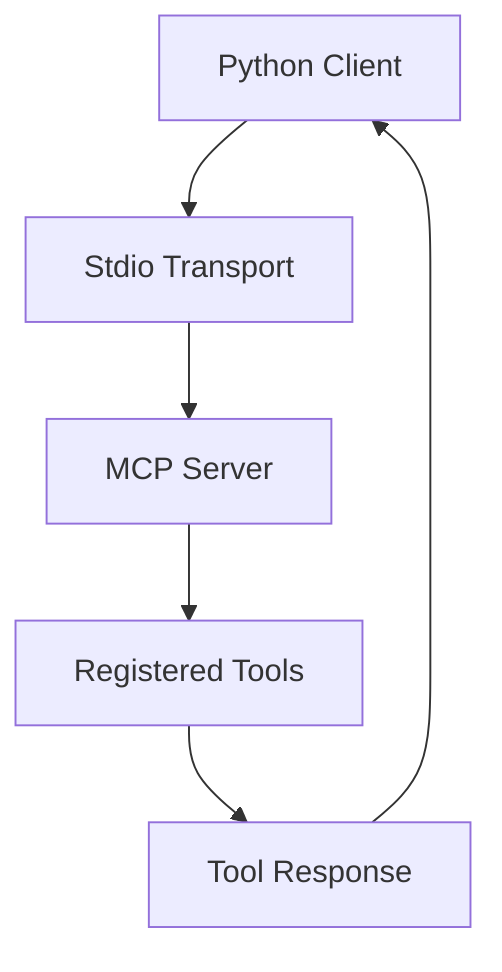
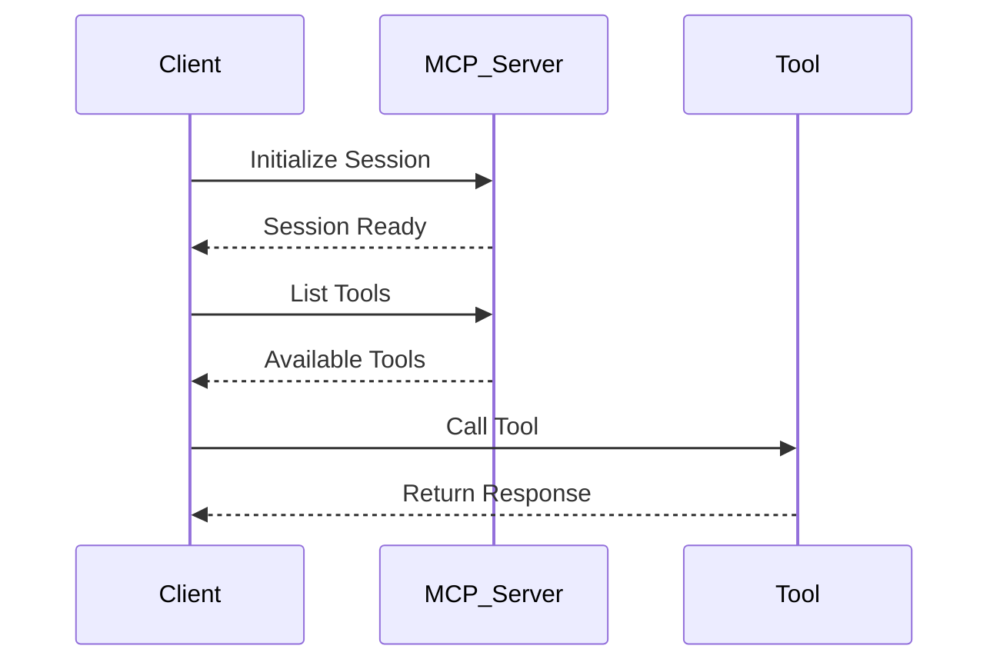

# Connect MCP Client to an MCP Server

A simple and beginner-friendly project that demonstrates how to connect an MCP Client to an MCP Server using Python and the Model Context Protocol (MCP).

This project includes:

- A custom MCP weather server
- A Python MCP client
- An NPX-based MCP client example
- Tool calling between client and server
- Async communication using stdio transport

---

# What is MCP?

[MCP (Model Context Protocol)](https://modelcontextprotocol.io/) is an open protocol that allows AI models and applications to communicate with external tools and services.

Using MCP, you can:

- Create custom AI tools
- Connect AI assistants to APIs
- Build local or remote AI servers
- Enable structured tool calling
- Connect AI clients and servers seamlessly

---

# What is UV?

[uv](https://docs.astral.sh/uv/) is a fast Python package and project manager written in Rust.

It helps developers:

- Create Python projects
- Manage dependencies
- Create virtual environments
- Run Python applications
- Replace tools like `pip`, `venv`, and `poetry`

UV is extremely fast and lightweight compared to traditional Python package managers.

---

# Installation

# Step 1 — Install Python

Download Python from the official website:

https://www.python.org/downloads/

Verify installation:

```bash
python --version
```

---

# Step 2 — Install UV

UV is a fast Python package manager and virtual environment manager.

## Windows

```bash
powershell -ExecutionPolicy ByPass -c "irm https://astral.sh/uv/install.ps1 | iex"
```

## Linux / macOS

```bash
curl -LsSf https://astral.sh/uv/install.sh | sh
```

Verify installation:

```bash
uv --version
```

---

# Step 3 — Create Virtual Environment

```bash
uv venv
```

Activate the virtual environment.

## Windows

```bash
.venv\Scripts\activate
```

## Linux / macOS

```bash
source .venv/bin/activate
```

---

# Step 4 — Install Required MCP Dependencies

After activating the virtual environment, install the required MCP packages.

## Recommended Command

```bash
uv add "mcp[cli]"
```

This command installs:

- MCP SDK
- MCP CLI tools
- Required dependencies
- HTTP support

---

# MCP Weather Server

The `weather.py` file creates a simple MCP server with a weather tool. :contentReference[oaicite:0]{index=0}

## Server Code Example

```python
See the weather.py file
```

---

# Running the MCP Server

Run the weather server using:

```bash
uv run weather.py
```

---

# Python MCP Client

The `client.py` file connects a Python client to the local MCP weather server. 

The client:

- Starts the MCP server
- Creates a client session
- Initializes the session
- Lists available tools
- Calls the `get_weather` tool

## Run the Python Client

```bash
uv run client.py
```

---

# NPX-Based MCP Client

The `client_npx.py` file demonstrates how to connect to an MCP server using `npx`.

This example connects to the Airbnb MCP server using:

```python
command="npx"
args=["-y", "@openbnb/mcp-server-airbnb", "--ignore-robots-txt"]
```

## Run the NPX Client

```bash
uv run client_npx.py
```

---

# How the Connection Works



---

# MCP Communication Flow



---

# Features

- Beginner-friendly MCP implementation
- Async client-server communication
- Tool registration using decorators
- Local MCP server connection
- NPX server integration
- Simple project structure

---

# Example Output

```bash
Starting stdio_client...
Client connected, creating session...
Initializing session...
Listing tools...
Available tools: get_weather
Calling tool...
Tool result: The Weather of your Jaunpur is hot and dry
```

---

# Technologies Used

- Python
- MCP SDK
- UV
- AsyncIO
- FastMCP

---

# References

- MCP Documentation: https://modelcontextprotocol.io/
- UV Documentation: https://docs.astral.sh/uv/
- MCP Python SDK: https://github.com/modelcontextprotocol/python-sdk

---


# 📬 Connect With Me

## 👨‍💻 Uditya Narayan Tiwari

🌐 Portfolio: https://udityanarayantiwari.netlify.app/  
📚 Knowledge Base: https://udityaknowledgebase.netlify.app/  
💻 GitHub: https://github.com/udityamerit  
🔗 LinkedIn: https://www.linkedin.com/in/uditya-narayan-tiwari-562332289/  

 