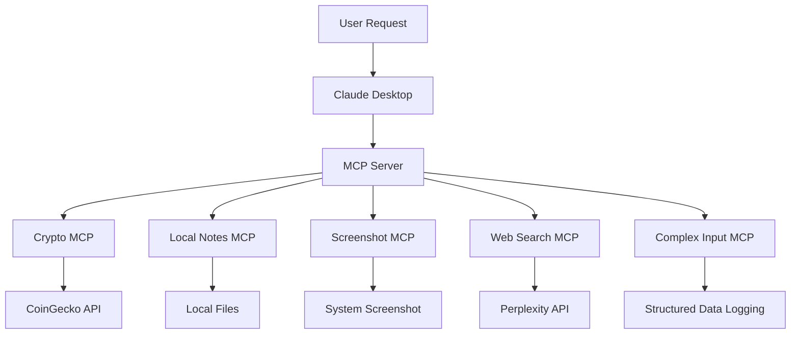
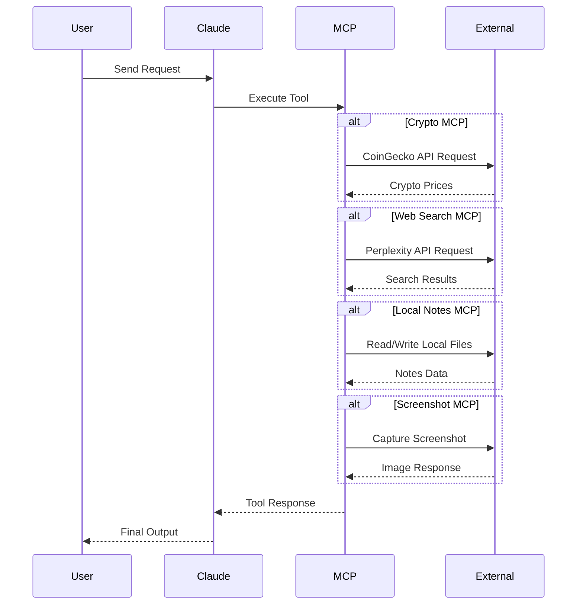

# MCP Tools Collection

A professional collection of MCP (Model Context Protocol) servers built using Python and FastMCP.  
This repository demonstrates how to create and run multiple MCP tools locally and connect them with Claude Desktop or any MCP-compatible client.

---

# Features

This project includes the following MCP servers:

- Cryptocurrency Price MCP
- Local Notes MCP
- Screenshot Capture MCP
- Web Search MCP using Perplexity AI
- Complex Structured Input MCP

---

# Requirements

Before running the project, make sure the following are installed:

- Python 3.10 or higher
- UV Package Manager
- Claude Desktop (Optional)

---

# Why Use `uv add` Instead of `pip install`?

Using `uv add`:

- Automatically manages dependencies
- Updates `pyproject.toml`
- Creates reproducible environments
- Faster than pip
- Recommended for MCP projects

---

# Complete Setup Commands

```bash
uv init
```

```bash
uv venv
```

## Activate Environment

### Windows

```bash
.\.venv\Scripts\activate
```

### Linux / macOS

```bash
source .venv/bin/activate
```

---

# Install MCP

```bash
uv add "mcp[cli]"
```

---

# Install Project Dependencies

```bash
uv add requests openai pyautogui pillow pydantic
```

---

# MCP Servers

# 1. Cryptocurrency Price MCP

## File

```bash
crypto.py
```

## Description

This MCP server fetches live cryptocurrency prices using the CoinGecko API.

## Features

- Real-time crypto prices
- INR and USD support
- Bitcoin, Ethereum, Dogecoin support
- API-based responses

## Run the Server

```bash
python crypto.py
```

## Example Query

```text
Get the price of bitcoin
```

---

# 2. Local Notes MCP

## File

```bash
local.py
```

## Description

This MCP server allows users to save and read local notes and HTML content.

## Features

- Add notes
- Read notes
- Save HTML content
- Read HTML content

## Run the Server

```bash
python local.py
```

## Example Queries

```text
Add note: Learn MCP
```

```text
Read my notes
```

---

# 3. Screenshot MCP

## File

```bash
screenshot.py
```

## Description

This MCP server captures screenshots from the local machine.

## Features

- Capture current screen
- Compressed image output
- Claude-compatible image response

## Run the Server

```bash
python screenshot.py
```

## Example Query

```text
Take a screenshot
```

---

# 4. Web Search MCP

## File

```bash
websearch_perpexity_model.py
```

## Description

This MCP performs AI-powered web search using the Perplexity AI API.

## Features

- AI-powered web search
- Real-time internet access
- Uses Sonar Pro model

---

## Setup API Key

Replace this line:

```python
YOUR_API_KEY = 'YOUR_PERPLEXITY_API_KEY'
```

with your actual Perplexity API key.

---

## Run the Server

```bash
python websearch_perpexity_model.py
```

## Example Query

```text
Search latest AI news
```

---

# 5. Complex Input MCP

## File

```bash
complex_input_mcp.py
```

## Description

This MCP demonstrates structured data handling using Pydantic models.

## Features

- Structured JSON input
- Input validation
- Data logging
- Pydantic integration

## Run the Server

```bash
python complex_input_mcp.py
```

## Example JSON Input

```json
{
  "first_name": "Uditya",
  "last_name": "Tiwari",
  "years_of_experience": 2,
  "previous_addresses": [
    "Delhi",
    "Bhopal"
  ]
}
```

---

# Connecting MCP Servers to Claude Desktop

Locate the Claude Desktop configuration file.

## Windows Path

```bash
C:\Users\YOUR_USERNAME\AppData\Roaming\Claude\claude_desktop_config.json
```

---

# Example Configuration

```json
{
  "mcpServers": {
    "crypto": {
      "command": "python",
      "args": ["C:/path/to/crypto.py"]
    },

    "localnotes": {
      "command": "python",
      "args": ["C:/path/to/local.py"]
    },

    "screenshot": {
      "command": "python",
      "args": ["C:/path/to/screenshot.py"]
    },

    "websearch": {
      "command": "python",
      "args": ["C:/path/to/websearch_perpexity_model.py"]
    },

    "complexinput": {
      "command": "python",
      "args": ["C:/path/to/complex_input_mcp.py"]
    }
  }
}
```

---

# Running MCP Servers Using UV

You can also run MCP servers using UV.

## Example

```json
{
  "mcpServers": {
    "crypto": {
      "command": "uv",
      "args": [
        "run",
        "C:/path/to/crypto.py"
      ]
    }
  }
}
```

---

# Architecture Diagram



---

# Data Flow Diagram



---

# Common Errors and Fixes

# 1. Failed to Connect to MCP

## Solution

- Verify Python installation
- Verify dependencies are installed
- Restart Claude Desktop
- Check correct file paths

---

# 2. Module Not Found Error

## Solution

Install the missing package.

```bash
uv pip install package_name
```

---

# 3. Screenshot Not Working

## Solution

PyAutoGUI works only in local desktop environments.

It may fail on:

- Remote servers
- Virtual machines
- Headless systems

---

# 4. API Key Error

## Solution

Add the correct Perplexity API key inside:

```python
YOUR_API_KEY = "your_actual_api_key"
```

---

# Technologies Used

- Python
- FastMCP
- Requests
- OpenAI SDK
- Pydantic
- PyAutoGUI
- Pillow
- UV Package Manager

---

# Future Improvements

- Database integration
- Multi-user support
- Authentication system
- Advanced tool orchestration
- Voice-enabled MCP tools

---

# 📬 Connect With Me

## 👨‍💻 Uditya Narayan Tiwari

🌐 Portfolio: https://udityanarayantiwari.netlify.app/  
📚 Knowledge Base: https://udityaknowledgebase.netlify.app/  
💻 GitHub: https://github.com/udityamerit  
🔗 LinkedIn: https://www.linkedin.com/in/uditya-narayan-tiwari-562332289/  

---

# License

This project is licensed under the MIT License.