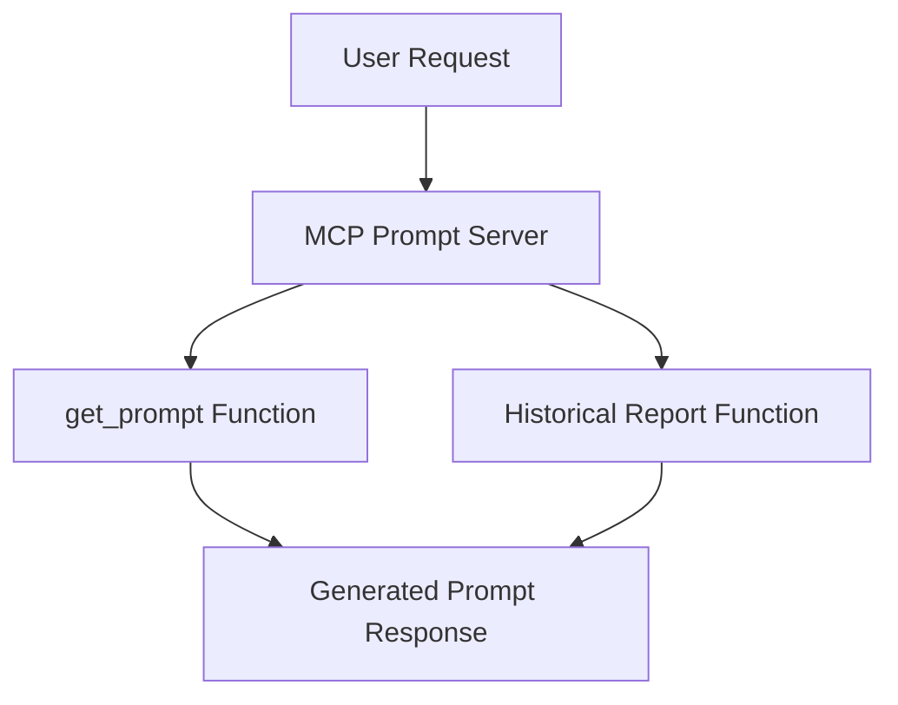
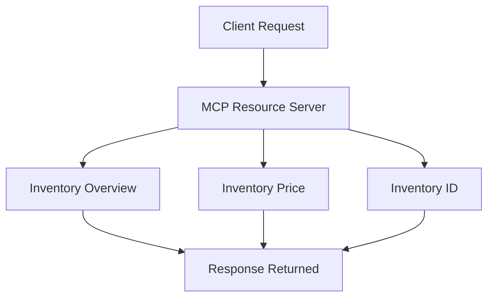
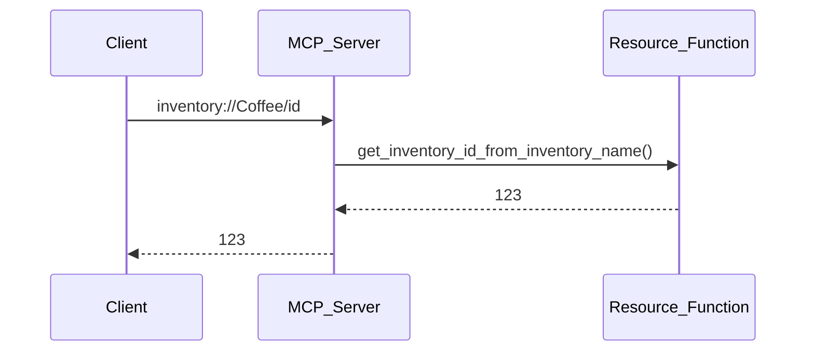

# MCP Server with Prompts and Resources

A beginner-friendly project to understand how to create **MCP (Model Context Protocol) Servers** using **Prompts** and **Resources** with Python.

This project demonstrates:

* How to create MCP prompt servers
* How to create MCP resource servers
* How MCP resources work using custom URIs
* How to expose structured AI prompts
* How to run MCP servers locally

---

# What is MCP?

MCP (Model Context Protocol) is a protocol that allows AI models and applications to interact with tools, prompts, and resources in a structured way.

Using MCP, developers can:

* Create reusable prompts
* Share structured resources
* Build AI-powered tools
* Connect AI models with external systems

---

# Project Structure

```bash
.
├── prompt.py
├── resources.py
├── pyproject.toml
└── README.md
```

---

# Installation

## 1. Clone the Repository

```bash
git clone <your-repository-url>
cd <project-folder>
```

---

## 2. Install UV (Recommended)

UV is a fast Python package manager and environment manager.

### Install UV

### Windows

```bash
powershell -ExecutionPolicy ByPass -c "irm https://astral.sh/uv/install.ps1 | iex"
```

### Linux / macOS

```bash
curl -LsSf https://astral.sh/uv/install.sh | sh
```

---

## 3. Create Virtual Environment

```bash
uv venv
```

Activate the environment:

### Windows

```bash
.venv\Scripts\activate
```

### Linux / macOS

```bash
source .venv/bin/activate
```

---

## 4. Install Dependencies

```bash
uv sync
```

---

# Dependencies

The project uses:

* `mcp[cli]`
* `requests`

Defined in:

```toml
[project]
dependencies = [
    "mcp[cli]>=1.27.1",
    "requests>=2.34.2",
]
```

---

# Understanding Prompt Server

File: `prompt.py`

This server creates reusable prompts using MCP.

---

# Prompt Server Architecture



---

# Available Prompts

## 1. Detailed Analysis Prompt

```python
@mcp.prompt()
def get_prompt(topic: str) -> str:
```

### Purpose

Creates a detailed research prompt for any topic.

### Example

Input:

```python
get_prompt("Artificial Intelligence")
```

Output:

```text
Do a detailed analysis on the following topic...
```

---

## 2. Historical Report Prompt

```python
@mcp.prompt()
def write_detailed_historical_report(topic: str, number_of_paragraphs: int) -> str:
```

### Purpose

Generates a structured historical research report prompt.

### Features

* Introduction section
* Main body
* Conclusion
* Timeline of events
* Custom paragraph count

---

# Running the Prompt Server

```bash
python prompt.py
```

---

# Understanding Resource Server

File: `resources.py`

This server demonstrates how MCP Resources work.

Resources expose structured data using custom URIs.

---

# Resource Server Architecture



---

# Available Resources

---

## 1. Inventory Overview

URI:

```text
inventory://overview
```

### Returns

```text
Inventory Overview:
- Coffee
- Tea
- Cookies
```

---

## 2. Get Price Using Inventory ID

URI Format:

```text
inventory://{inventory_id}/price
```

### Example

```text
inventory://123/price
```

### Output

```text
6.99
```

---

## 3. Get Inventory ID Using Name

URI Format:

```text
inventory://{inventory_name}/id
```

### Example

```text
inventory://Coffee/id
```

### Output

```text
123
```

---

# Resource Flow Example



---

# Running the Resource Server

```bash
python resources.py
```

---

# Key Concepts Learned

This project helps you understand:

* MCP Server basics
* MCP Prompts
* MCP Resources
* Resource URI handling
* Dynamic parameters in resources
* AI prompt engineering
* Structured AI workflows

---

# How MCP Resources Work

MCP resources work like APIs but use URI-based access.

Example:

```text
inventory://123/price
```

The server extracts:

* `123` as inventory ID
* Calls the matching function
* Returns the result

---

# Why Use MCP?

MCP is useful for:

* AI agents
* Tool calling
* AI workflows
* Prompt management
* Data sharing
* Building AI applications

---

# Future Improvements

You can extend this project by adding:

* Database integration
* Real inventory system
* API support
* Authentication
* AI chatbot integration
* Dynamic data storage
* Web dashboard

---

# Author

Uditya Narayan Tiwari

## Connect With Me

* Portfolio: https://udityanarayantiwari.netlify.app/
* GitHub: https://github.com/udityamerit
* LinkedIn: https://www.linkedin.com/in/uditya-narayan-tiwari-562332289/

---

# License

This project is open-source and free to use for learning purposes.
