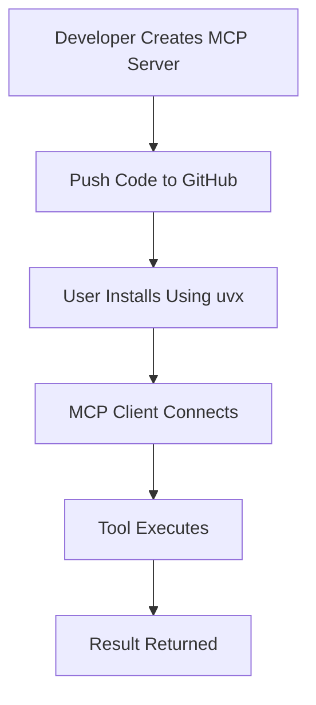
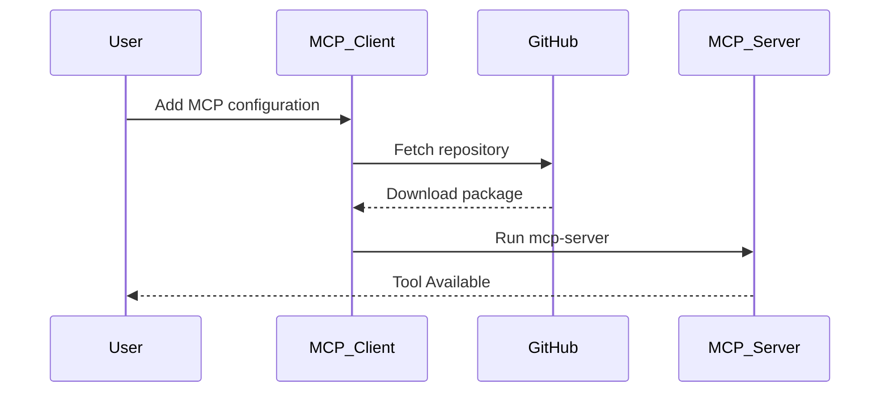

# Publishing and Deploying Your MCP Server

This section explains how to publish your own MCP server so that other developers can easily use it directly from GitHub.

---

# Why Publish an MCP Server?

Publishing your MCP server allows:

* Easy sharing with other developers
* Reusable AI tools
* Direct installation using `uvx`
* Remote MCP integrations
* Faster collaboration

Once published, users can connect your MCP server directly inside MCP-compatible clients.

---

# Example MCP Tool Server

Example file: `server.py`

```python
from mcp.server.fastmcp import FastMCP

mcp = FastMCP("Demo")

@mcp.tool()
def add(a: int, b: int) -> int:
    """Add two numbers"""
    return a + b
```

This creates a simple addition tool.

---

# Project Architecture



---

# Step 1: Create Project Structure

Recommended structure:

```bash
.
├── src/
│   └── mcpserver/
│       ├── __init__.py
│       ├── __main__.py
│       └── server.py
├── pyproject.toml
├── README.md
└── .gitignore
```

---

# Step 2: Configure `pyproject.toml`

Example configuration:

```toml
[project]
name = "07-mcp-server-deployment-and-publishing"
version = "0.1.0"
requires-python = ">=3.11"

dependencies = [
    "mcp[cli]>=1.27.1",
    "requests>=2.34.2",
]

[project.scripts]
mcp-server = "mcpserver.__main__:main"
```

---

# Understanding `project.scripts`

```toml
[project.scripts]
mcp-server = "mcpserver.__main__:main"
```

This creates a runnable command:

```bash
mcp-server
```

When users install your MCP server, this command becomes available automatically.

---

# Step 3: Create `__main__.py`

Inside:

```bash
src/mcpserver/__main__.py
```

Add:

```python
from .server import mcp

def main():
    mcp.run()

if __name__ == "__main__":
    main()
```

This acts as the entry point for your MCP server.

---

# Step 4: Push the Project to GitHub

Initialize Git:

```bash
git init
```

Add files:

```bash
git add .
```

Commit changes:

```bash
git commit -m "Initial MCP server"
```

Connect GitHub repository:

```bash
git remote add origin https://github.com/yourusername/your-repository.git
```

Push code:

```bash
git push -u origin main
```

---

# Step 5: Install the MCP Server from GitHub

Users can directly install your MCP server using:

```json
{
  "mcpServers": {
    "add_tool": {
      "command": "uvx",
      "args": [
        "--from",
        "git+your github link",
        "mcp-server"
      ]
    }
  }
}
```

---

# How This Works

The process works like this:



---

# Understanding the Configuration

## `uvx`

`uvx` allows users to run Python packages directly without manual installation.

---

## `--from`

```bash
--from git+https://github.com/your-repository.git
```

This tells UV to fetch the package from GitHub.

---

## `mcp-server`

This is the command defined in:

```toml
[project.scripts]
mcp-server = "mcpserver.__main__:main"
```

---

# Step 6: Run the MCP Server Locally

Run:

```bash
uv run mcp-server
```

or

```bash
python -m mcpserver
```

---

# Testing Your MCP Server

You can test your MCP server using:

```bash
mcp dev server.py
```

This opens the MCP Inspector for debugging and testing.

---

# Full Deployment Workflow


---

# Best Practices

## Use Proper Documentation

Always include:

* Installation steps
* Example usage
* Tool descriptions
* Architecture diagrams

---

## Use Meaningful Tool Names

Good example:

```python
def add_numbers(a: int, b: int)
```

Bad example:

```python
def x(a, b)
```

---

## Keep Tools Modular

Separate:

* Tools
* Resources
* Prompts
* Utilities

Into different files.

---

# Advantages of Publishing MCP Servers

* Reusable AI tools
* Easy distribution
* Better collaboration
* Direct GitHub installation
* Fast AI integrations
* Community sharing

---

# Real World Use Cases

MCP servers can be used for:

* AI assistants
* Data analysis
* Research automation
* Weather APIs
* Database querying
* AI coding agents
* Enterprise automation
* Chatbot integrations

---

# Future Improvements

You can improve your MCP server by adding:

* Authentication
* API integrations
* Database storage
* Cloud deployment
* Logging
* Error handling
* Docker support
* CI/CD pipelines

---

# Conclusion

This project demonstrates:

* Creating MCP tools
* Publishing MCP servers
* GitHub-based installation
* MCP deployment workflow
* Professional MCP packaging

It provides a strong foundation for building production-level MCP applications.

# 📬 Connect With Me

## 👨‍💻 Uditya Narayan Tiwari

🌐 Portfolio: https://udityanarayantiwari.netlify.app/  
📚 Knowledge Base: https://udityaknowledgebase.netlify.app/  
💻 GitHub: https://github.com/udityamerit  
🔗 LinkedIn: https://www.linkedin.com/in/uditya-narayan-tiwari-562332289/  
