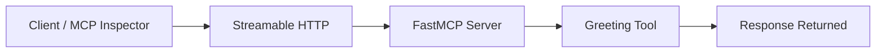
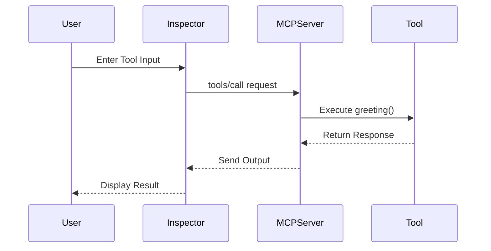
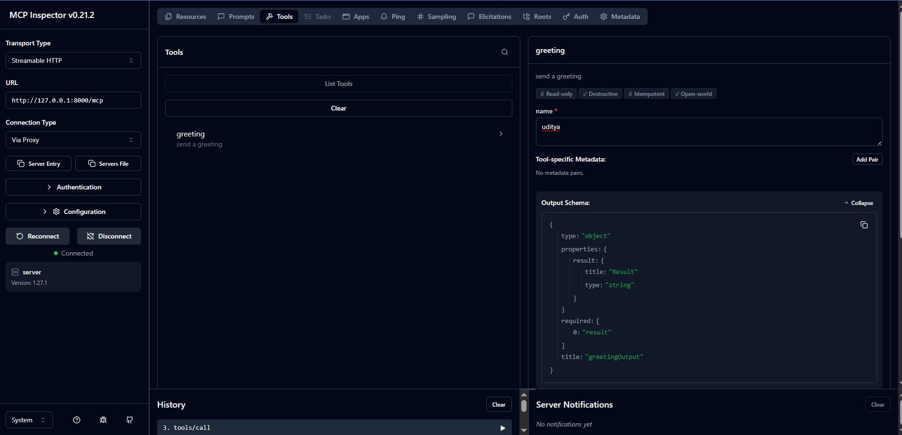
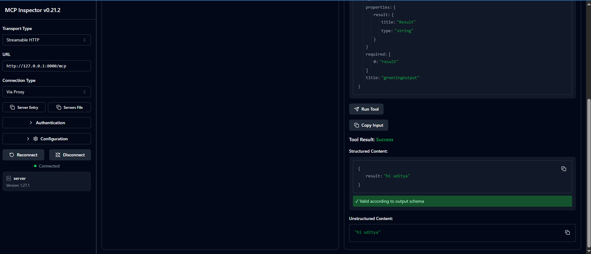
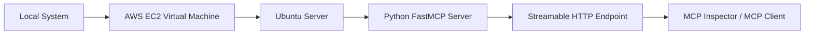
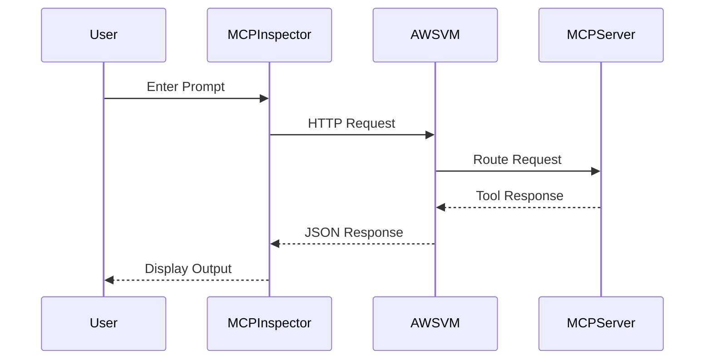
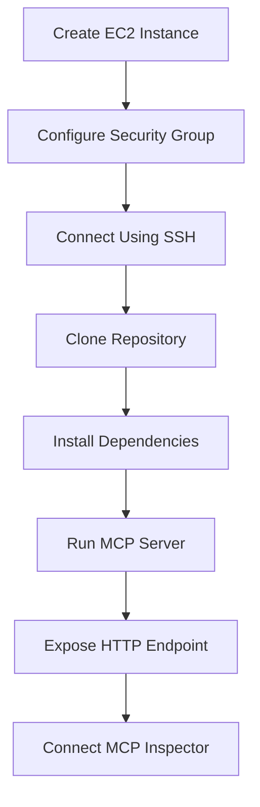

# MCP Server using Streamable HTTP

A simple and professional MCP (Model Context Protocol) Server built using Python and FastMCP with Streamable HTTP transport.

This project demonstrates:

* Creating an MCP server using FastMCP
* Exposing custom MCP tools
* Running the server using Streamable HTTP
* Testing the server using MCP Inspector
* Connecting the server remotely using `mcp-remote`

---

# Project Structure

```bash
.
├── images/
│   ├── mcp_inspector1.PNG
│   └── mcp_inspector2.PNG
├── main.py
├── server.py
├── pyproject.toml
├── README.md
└── .python-version
```

---

# Architecture Flow



---

# Working Flow



---

# Requirements

* Python 3.11+
* UV Package Manager
* MCP Python SDK
* Node.js (for MCP Inspector)

---

# Installation

## 1. Clone the Repository

```bash
git clone <your-repository-url>
cd <your-project-folder>
```

---

## 2. Install UV

### Windows

```bash
powershell -ExecutionPolicy ByPass -c "irm https://astral.sh/uv/install.ps1 | iex"
```

### Linux / macOS

```bash
curl -LsSf https://astral.sh/uv/install.sh | sh
```

---

## 3. Create Virtual Environment

```bash
uv venv
```

---

## 4. Activate Virtual Environment

### Windows

```bash
.venv\Scripts\activate
```

### Linux / macOS

```bash
source .venv/bin/activate
```

---

## 5. Install Dependencies

```bash
uv sync
```

---

# Dependencies

Your project uses the following dependency:

```toml
[project]
name = "08-mcp-server-stdio-and-streamable-https"
version = "0.1.0"
description = "Add your description here"
readme = "README.md"
requires-python = ">=3.11"
dependencies = [
    "mcp[cli]>=1.27.1",
]
```

---

# Server Code

## server.py

```python
from mcp.server.fastmcp import FastMCP

mcp = FastMCP("server")


@mcp.tool()
def greeting(name: str) -> str:
    "send a greeting"
    return f"hi {name}"

if __name__=="__main__":
    mcp.run(transport="streamable-http")
```

---

# Run the MCP Server

```bash
python server.py
```

Server will start on:

```bash
http://127.0.0.1:8000/mcp
```

---

# Open MCP Inspector

Run the MCP Inspector using:

```bash
npx @modelcontextprotocol/inspector
```

---

# MCP Inspector Configuration

Inside MCP Inspector:

| Field           | Value                                                  |
| --------------- | ------------------------------------------------------ |
| Transport Type  | Streamable HTTP                                        |
| URL             | [http://127.0.0.1:8000/mcp](http://127.0.0.1:8000/mcp) |
| Connection Type | Via Proxy                                              |

---

# MCP Inspector Output

## Connected MCP Server



---

## Tool Execution Result



---

# Tool Explanation

## greeting Tool

This tool accepts a name as input and returns a greeting response.

### Input

```json
{
  "name": "uditya"
}
```

### Output

```json
{
  "result": "hi uditya"
}
```

---

# Connect Remote MCP Server

For the connection the HTTPS remote MCP server, use this configuration:

```json
{
  "mcpServers": {
    "remote-example": {
      "command": "npx",
      "args": [
        "mcp-remote",
        "http://127.0.0.1:8000/mcp",
        "--allow-http"
      ]
    }
  }
}
```

---

# How It Works

1. The MCP server starts using FastMCP.
2. The server exposes tools using the `@mcp.tool()` decorator.
3. MCP Inspector connects to the Streamable HTTP endpoint.
4. The client sends a `tools/call` request.
5. The tool executes and returns structured output.
6. The response is validated against the output schema.

---

# Example Response Schema

```json
{
  "type": "object",
  "properties": {
    "result": {
      "title": "Result",
      "type": "string"
    }
  },
  "required": [
    "result"
  ],
  "title": "greetingOutput"
}
```

---

# Deploy MCP Server on AWS EC2 Virtual Machine

This section explains how to connect and run your MCP Streamable HTTP Server on an AWS EC2 Virtual Machine using HTTP.

---

# AWS Architecture



---

# Step-by-Step AWS Deployment

## Step 1: Create AWS Account

Go to:

```text
https://aws.amazon.com/
```

Create an AWS account.

---

# Step 2: Launch EC2 Instance

## Open EC2 Dashboard

Search for:

```text
EC2
```

Click:

```text
Launch Instance
```

---

## Configure EC2 Instance

| Setting       | Value               |
| ------------- | ------------------- |
| Name          | mcp-server          |
| AMI           | Ubuntu Server 22.04 |
| Instance Type | t2.micro            |
| Key Pair      | Create new key pair |
| Network       | Default             |

---

# Step 3: Configure Security Group

Allow the following ports:

| Type       | Port |
| ---------- | ---- |
| SSH        | 22   |
| Custom TCP | 8000 |
| HTTP       | 80   |

This allows:

* SSH connection
* MCP HTTP server access
* External communication

---

# Step 4: Connect to EC2 Instance

## Windows PowerShell

```bash
ssh -i your-key.pem ubuntu@YOUR_PUBLIC_IP
```

---

# Step 5: Update Ubuntu Packages

```bash
sudo apt update && sudo apt upgrade -y
```

---

# Step 6: Install Python and Pip

```bash
sudo apt install python3 python3-pip python3-venv -y
```

---

# Step 7: Install Git

```bash
sudo apt install git -y
```

---

# Step 8: Clone Your Repository

```bash
git clone <your-github-repository>
cd <repository-name>
```

---

# Step 9: Create Virtual Environment

```bash
python3 -m venv .venv
```

---

# Step 10: Activate Virtual Environment

```bash
source .venv/bin/activate
```

---

# Step 11: Install Dependencies

```bash
pip install -e .
```

or

```bash
uv sync
```

---

# Step 12: Update Server Host

Modify your `server.py`:

```python
from mcp.server.fastmcp import FastMCP

mcp = FastMCP("server")


@mcp.tool()
def greeting(name: str) -> str:
    return f"hi {name}"

if __name__ == "__main__":
    mcp.run(
        transport="streamable-http",
        host="0.0.0.0",
        port=8000
    )
```

---

# Why Use 0.0.0.0?

```text
127.0.0.1 → Local machine only
0.0.0.0 → Accessible from external systems
```

This allows your AWS VM to expose the MCP server publicly.

---

# Step 13: Run MCP Server

```bash
python server.py
```

Server runs on:

```text
http://YOUR_PUBLIC_IP:8000/mcp
```

---

# Step 14: Test Server in Browser

Open:

```text
http://YOUR_PUBLIC_IP:8000/mcp
```

---

# Step 15: Connect MCP Inspector

Run MCP Inspector locally:

```bash
npx @modelcontextprotocol/inspector
```

---

# MCP Inspector Configuration for AWS

| Field           | Value                          |
| --------------- | ------------------------------ |
| Transport Type  | Streamable HTTP                |
| URL             | http://YOUR_PUBLIC_IP:8000/mcp |
| Connection Type | Via Proxy                      |

---

# Connection Flow



---

# Run Server in Background

Install screen:

```bash
sudo apt install screen -y
```

Start screen:

```bash
screen -S mcpserver
```

Run server:

```bash
python server.py
```

Detach screen:

```bash
CTRL + A + D
```

---

# Optional: Use Nginx Reverse Proxy

Install nginx:

```bash
sudo apt install nginx -y
```

---

# Nginx Configuration

```nginx
server {
    listen 80;

    server_name YOUR_PUBLIC_IP;

    location / {
        proxy_pass http://127.0.0.1:8000;
        proxy_set_header Host $host;
        proxy_set_header X-Real-IP $remote_addr;
    }
}
```

---

# Restart Nginx

```bash
sudo systemctl restart nginx
```

---

# Access MCP Server

```text
http://YOUR_PUBLIC_IP/mcp
```

---

# Benefits of AWS Deployment

* Publicly accessible MCP server
* Easy integration with AI agents
* Cloud-hosted infrastructure
* Remote access from anywhere
* Scalable architecture
* Production-ready setup

---

# Production Recommendations

* Use HTTPS with SSL
* Use domain names
* Add authentication
* Use Docker
* Add monitoring
* Add logging
* Use process managers like PM2 or Supervisor
* Use AWS Load Balancer for scaling

---

# Common Errors and Fixes

| Error                 | Solution                         |
| --------------------- | -------------------------------- |
| Connection Refused    | Open port 8000 in Security Group |
| Timeout Error         | Check EC2 Public IP              |
| Cannot Connect        | Use host=0.0.0.0                 |
| Inspector Not Working | Verify Streamable HTTP URL       |
| SSH Failed            | Check PEM key permissions        |

---

# AWS Deployment Flow



---

# Reference

* MCP Python SDK
* MCP Inspector
* FastMCP
* mcp-remote : https://www.npmjs.com/package/mcp-remote

---

# 📬 Connect With Me

## 👨‍💻 Uditya Narayan Tiwari

🌐 Portfolio: https://udityanarayantiwari.netlify.app/  
📚 Knowledge Base: https://udityaknowledgebase.netlify.app/  
💻 GitHub: https://github.com/udityamerit  
🔗 LinkedIn: https://www.linkedin.com/in/uditya-narayan-tiwari-562332289/  
