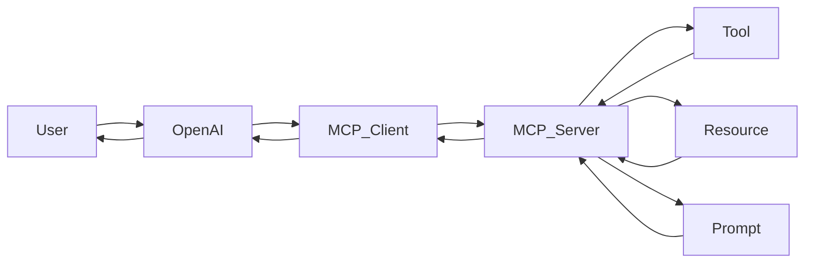
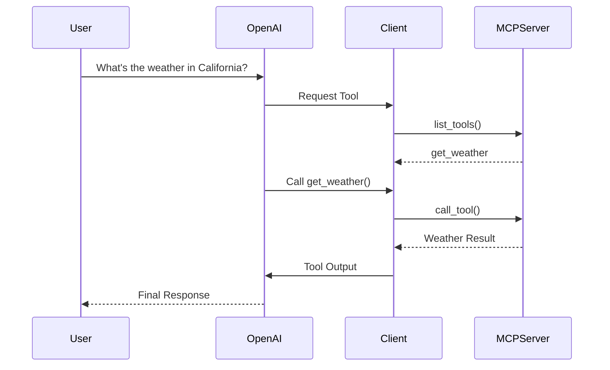
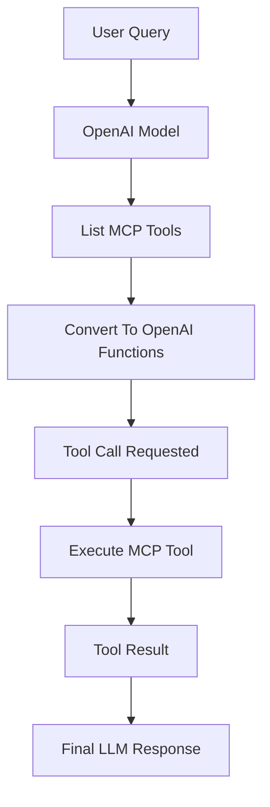
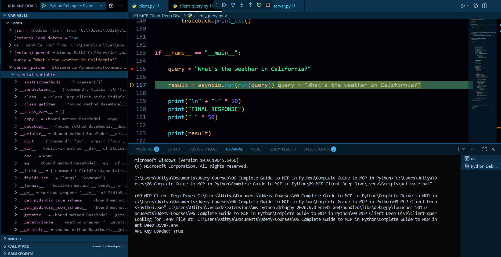
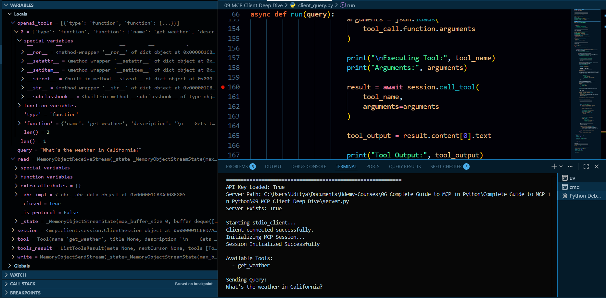
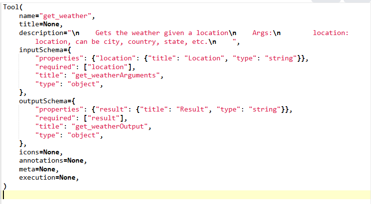
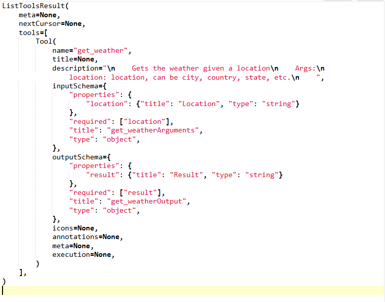

# MCP Weather Server with OpenAI Tool Calling

A complete example demonstrating how to connect an MCP Client to an MCP Server using Python, FastMCP, and OpenAI Function Calling.

This project shows how an LLM can automatically discover tools from an MCP server, invoke them when required, and return the final answer to the user.

---

## Features

- MCP Server using FastMCP
- Tool Registration
- Resource Registration
- Prompt Registration
- MCP Client Communication
- OpenAI Tool Calling Integration
- Automatic Tool Selection
- Environment Variable Support
- Full Debug Logging

---

# Project Structure

```text
.
│
├── server.py
├── client.py
├── client_query.py
├── .env
│
├── Images/
│   ├── mcp_debug1.PNG
│   ├── mcp_debug3.PNG
│   ├── debug_io.PNG
│   └── debug2.PNG
│
└── README.md
```

---

# Architecture



---

# MCP Communication Flow



---

# Technologies Used

| Technology | Purpose |
|------------|----------|
| Python | Backend Development |
| MCP | Model Context Protocol |
| FastMCP | MCP Server Framework |
| OpenAI API | Function Calling |
| uv | Environment Management |
| AsyncIO | Async Communication |

---

# Server Implementation

The MCP Server exposes:

## Tool

```python
get_weather(location)
```

Returns weather information for a given location.

---

## Resources

```python
weather://statement
```

Returns a general weather statement.

```python
weather://{city}/statement
```

Returns city-specific weather statements.

---

## Prompt

```python
get_prompt(topic)
```

Returns a research prompt related to weather concepts.

---

# Client Implementation

The client demonstrates:

- Connecting to MCP Server
- Initializing Session
- Listing Tools
- Calling Tools
- Reading Resources
- Reading Resource Templates
- Getting Prompts

---

# OpenAI Integration

The advanced client:

1. Connects to MCP Server
2. Discovers available tools
3. Converts MCP Tools → OpenAI Functions
4. Sends User Query
5. Lets GPT decide whether tools are needed
6. Executes MCP Tool
7. Returns final answer

---

# Execution Flow



---

# Installation

## Clone Repository

```bash
git clone <repository-url>
cd project-folder
```

---

## Create Virtual Environment

```bash
uv venv
```

Activate:

### Windows

```bash
.venv\Scripts\activate
```

### Linux / Mac

```bash
source .venv/bin/activate
```

---

## Install Dependencies

```bash
uv pip install mcp openai python-dotenv
```

---

## Configure Environment

Create:

```env
OPENAI_API_KEY=your_api_key_here
```

---

# Running The MCP Server

```bash
uv run server.py
```

---

# Running Basic Client

```bash
uv run client.py
```

Expected Output:

```text
Starting stdio_client...
Client connected...
Initializing session...
Available tools...
Tool result...
```

---

# Running OpenAI Integrated Client

```bash
uv run client_query.py
```

Example Query:

```python
query = "What's the weather in California?"
```

Example Output:

```text
Tool Call Requested

Executing Tool: get_weather

Arguments:
{
  "location": "California"
}

Tool Output:
The weather in California is hot and dry
```

---

# Debug Screenshots

## 1. MCP Tool Discovery

Shows successful tool discovery from MCP Server.

```md
Images Path:
Images/mcp_debug1.PNG
```

<p align="center">

</p>

---

## 2. MCP Tool Metadata

Displays generated schema information exposed by MCP.

```md
Images Path:
Images/mcp_debug3.PNG
```

<p align="center">

</p>

---

## 3. OpenAI Tool Conversion

Illustrates MCP tools being converted into OpenAI Function Calling format.

```md
Images Path:
Images/debug_io.PNG
```

<p align="center">

</p>

---

## 4. Tool Execution Debugging

Shows actual tool execution and response flow.

```md
Images Path:
Images/debug2.PNG
```

<p align="center">

</p>

---

# Key Concepts Learned

- MCP Architecture
- FastMCP Server Development
- Tool Registration
- Resources
- Resource Templates
- Prompts
- MCP Sessions
- Tool Discovery
- Tool Invocation
- OpenAI Function Calling
- LLM Tool Routing
- Async Programming
- Debugging MCP Applications

---

# Example Workflow

```text
User Question
      │
      ▼

OpenAI Receives Query
      │
      ▼

Tool Needed?
      │
      ├── No
      │      ▼
      │   Direct Response
      │
      └── Yes
             ▼

      MCP Tool Execution
             ▼

      Tool Output
             ▼

      Final LLM Response
```

---

# Future Improvements

- Multiple Tools
- Database Integration
- Weather API Integration
- Multi-Agent MCP Systems
- MCP Resource Caching
- Custom Prompt Templates
- Streaming Responses
- Authentication Layer

---

# Author

## 👨‍💻 Uditya Narayan Tiwari

🌐 Portfolio: https://udityanarayantiwari.netlify.app/  
📚 Knowledge Base: https://udityaknowledgebase.netlify.app/  
💻 GitHub: https://github.com/udityamerit  
🔗 LinkedIn: https://www.linkedin.com/in/uditya-narayan-tiwari-562332289/  

---

## Star The Repository

If this project helped you understand MCP and OpenAI Tool Calling, consider giving it a ⭐ on GitHub.