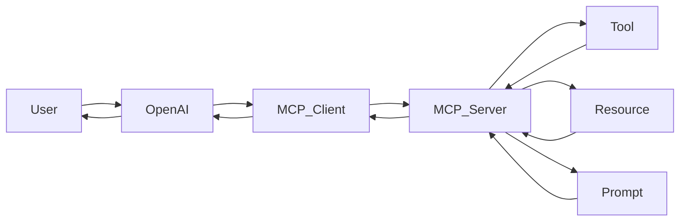
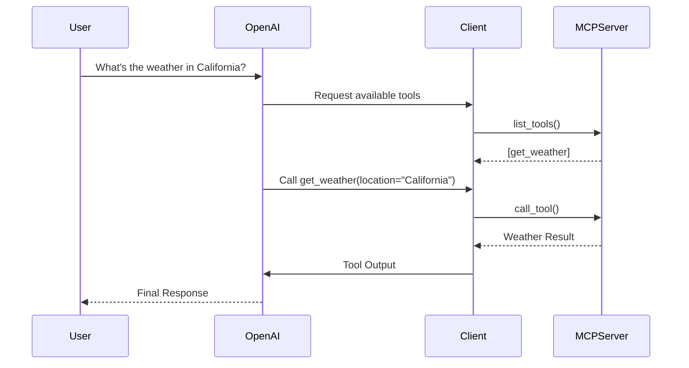
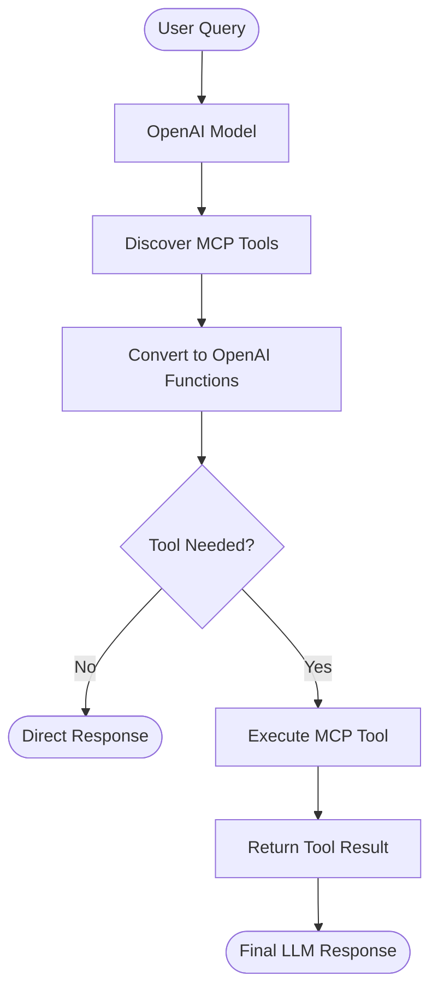

<div align="center">

<h1>🤖 MCP Weather Server with OpenAI Tool Calling</h1>

<p>A production-ready example demonstrating how to connect an MCP Client to an MCP Server using Python, FastMCP, and OpenAI Function Calling — enabling an LLM to automatically discover tools, invoke them intelligently, and return structured answers to users.</p>


</div>

---

## 📌 Overview

This project demonstrates a complete end-to-end integration between:

- A **FastMCP server** that exposes tools, resources, and prompts
- An **MCP client** that connects, discovers, and invokes those tools
- **OpenAI's Function Calling** API that routes user queries to the right tool automatically

It is designed as a learning reference for developers who want to understand how LLMs can interact with external services through the Model Context Protocol.

---

## ✨ Features

- MCP Server built with **FastMCP**
- **Tool**, **Resource**, and **Prompt** registration
- Dynamic **tool discovery** from the MCP server
- Automatic **MCP → OpenAI Function** conversion
- Intelligent tool routing via **OpenAI Function Calling**
- Full **async** communication with `asyncio`
- Clean **environment variable** support via `.env`
- Debug logging throughout the pipeline

---

## 🏗️ Architecture



---

## 🔄 Communication Flow



---

## ⚙️ Execution Flow



---

## 🛠️ Tech Stack

| Technology | Role |
|---|---|
| Python 3.10+ | Core language |
| MCP | Model Context Protocol |
| FastMCP | MCP server framework |
| OpenAI API | LLM + Function Calling |
| uv | Virtual environment & package manager |
| AsyncIO | Async client-server communication |

---

## 📡 Server Capabilities

### Tool

```python
get_weather(location: str) -> str
```

Returns weather information for the given location.

---

### Resources

| URI | Description |
|---|---|
| `weather://statement` | Returns a general weather statement |
| `weather://{city}/statement` | Returns a city-specific weather statement |

---

### Prompt

```python
get_prompt(topic: str) -> str
```

Returns a research prompt related to weather concepts.

---

## 💡 Client Capabilities

The client demonstrates:

- Connecting and initializing an MCP session
- Listing available tools, resources, and resource templates
- Invoking tools and reading resources
- Fetching prompts
- Converting MCP tools to OpenAI function schemas
- Running a full agentic query loop with tool execution

---

## 🚀 Getting Started

### 1. Clone the Repository

```bash
git clone https://github.com/udityamerit/Complete-Guide-to-MCP-in-Python.git

cd 09 MCP Client Deep Dive
```

### 2. Create a Virtual Environment

```bash
uv venv
```

Activate it:

**Windows:**
```bash
.venv\Scripts\activate
```

**Linux / macOS:**
```bash
source .venv/bin/activate
```

### 3. Install Dependencies

```bash
uv pip install mcp openai python-dotenv
```

### 4. Configure Environment Variables

Create a `.env` file in the project root:

```env
OPENAI_API_KEY=your_openai_api_key_here
```

---

## ▶️ Running the Project

### Start the MCP Server

```bash
uv run server.py
```

### Run the Basic Client

```bash
uv run client.py
```

Expected output:

```
Starting stdio_client...
Client connected...
Initializing session...
Available tools: [get_weather]
Tool result: The weather in California is hot and dry
```

### Run the OpenAI-Integrated Client

```bash
uv run client_query.py
```

Example:

```python
query = "What's the weather in California?"
```

Output:

```
Tool Call Requested

Executing Tool : get_weather
Arguments      : { "location": "California" }
Tool Output    : The weather in California is hot and dry
Final Response : The current weather in California is hot and dry.
```

---

## 🐛 Debugging

### Tool Discovery

Successful tool discovery from the MCP server shows available functions and their input schemas.

### Tool Metadata

Displays the generated JSON schema exposed by the MCP server for each tool.

### OpenAI Function Conversion

Illustrates how MCP tool schemas are mapped into OpenAI Function Calling format.

### Tool Execution

Shows the full request → tool invocation → response pipeline with intermediate outputs.

---

## 📚 Key Concepts

| Concept | Description |
|---|---|
| MCP Architecture | How clients and servers communicate via the Model Context Protocol |
| FastMCP | Simplified MCP server development framework |
| Tool Registration | Exposing callable functions to an LLM |
| Resources | Structured data sources the client can read |
| Resource Templates | Parameterized URIs for dynamic resources |
| Prompts | Pre-built prompt templates for consistent LLM behavior |
| OpenAI Function Calling | Enabling the LLM to decide when and how to call a tool |
| Async Programming | Non-blocking I/O for client-server communication |

---


## 👨‍💻 Author

**Uditya Narayan Tiwari**

[](https://udityanarayantiwari.netlify.app/)
[](https://udityaknowledgebase.netlify.app/)
[](https://github.com/udityamerit)
[](https://www.linkedin.com/in/uditya-narayan-tiwari-562332289/)

---

<div align="center">

If this project helped you understand MCP and OpenAI Tool Calling, consider giving it a ⭐ on GitHub!

</div>
