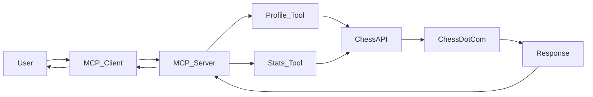
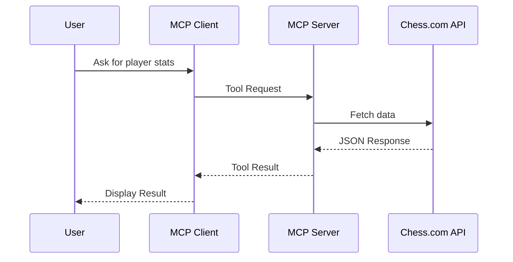
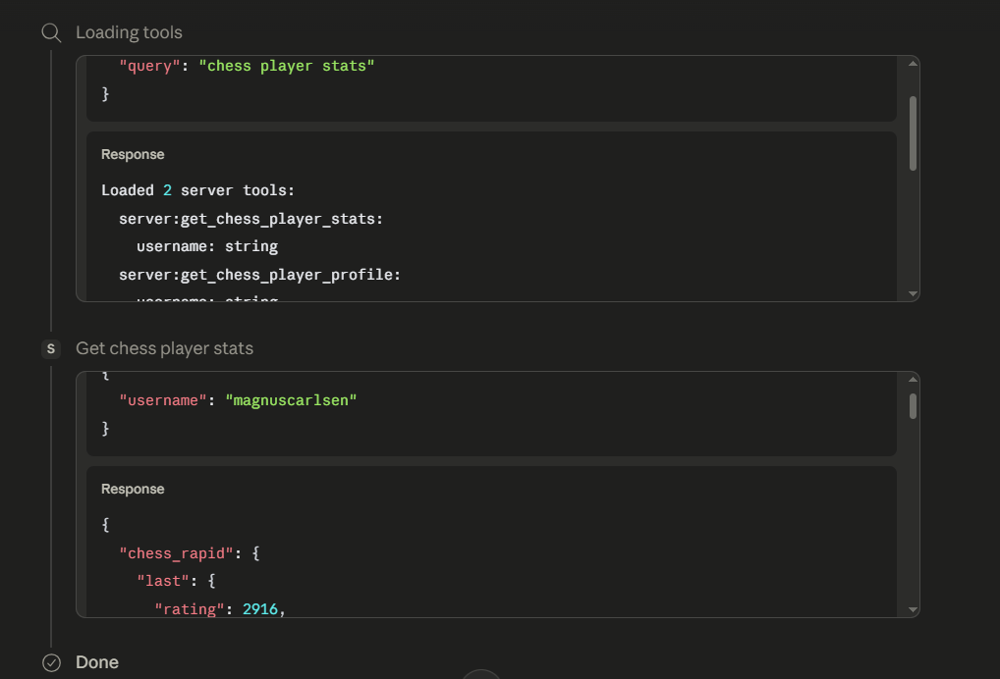
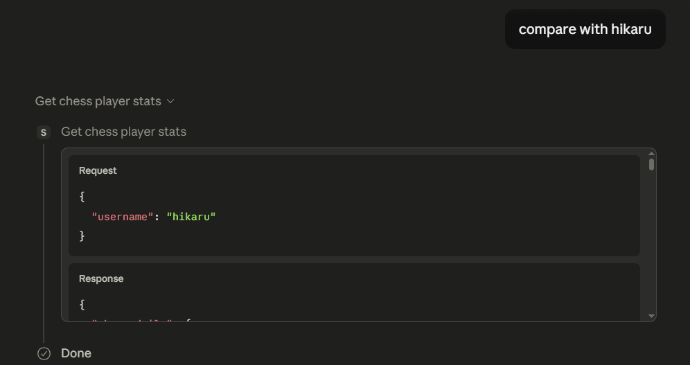
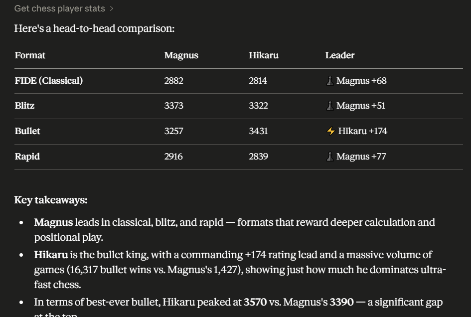

# ♟️ Chess.com MCP Server

A simple and powerful **Model Context Protocol (MCP) Server** that integrates with the Chess.com Public API and allows AI assistants to fetch player profiles and statistics directly through MCP tools.

This project demonstrates how to build a custom MCP server that exposes Chess.com data as reusable tools for AI applications.

---

## Features

- Get Chess.com player profile information
- Get Chess.com player statistics
- Expose data through MCP tools
- Easy integration with Claude Desktop, ChatGPT MCP, and other MCP-compatible clients
- Lightweight and beginner-friendly implementation

---

## Project Structure

```text
chess-stats/
│
├── src/
│   └── chess/
│       ├── chess_api.py
│       └── server.py
│
├── Images/
│   ├── re1.PNG
│   ├── re2.PNG
│   └── re3.PNG
│
├── pyproject.toml
└── README.md
````

---

## Architecture



---

## How It Works

The MCP server exposes two tools:

### 1. Get Player Profile

Retrieves public information about a Chess.com player.

```python
get_chess_player_profile(username)
```

Example:

```text
get_chess_player_profile("magnuscarlsen")
```

Returns:

* Username
* Country
* Followers
* Join Date
* Status
* Avatar
* Title
* URL

---

### 2. Get Player Statistics

Retrieves a player's chess ratings and game statistics.

```python
get_chess_player_stats(username)
```

Example:

```text
get_chess_player_stats("magnuscarlsen")
```

Returns:

* Rapid Rating
* Blitz Rating
* Bullet Rating
* Win/Loss Records
* Puzzle Ratings
* Tactics Ratings

---

## Available MCP Tools

| Tool                     | Description                      |
| ------------------------ | -------------------------------- |
| get_chess_player_profile | Fetch player profile information |
| get_chess_player_stats   | Fetch player statistics          |

These tools are automatically discovered by MCP clients. 

---

# API Layer

The server communicates with the official Chess.com Public API using the Requests library.

### Profile Endpoint

```http
GET https://api.chess.com/pub/player/{username}
```

### Stats Endpoint

```http
GET https://api.chess.com/pub/player/{username}/stats
```

Implemented inside:

```python
chess_api.py
```


---

## Installation

### Clone Repository

```bash
git clone https://github.com/udityamerit/Complete-Guide-to-MCP-in-Python.git

cd chess-stats
```

---

### Create Virtual Environment

```bash
uv venv
```

Activate:

#### Windows

```bash
.venv\Scripts\activate
```

#### Linux / MacOS

```bash
source .venv/bin/activate
```

---

### Install Dependencies

```bash
uv sync
```

Dependencies are defined in:

```toml
pyproject.toml
```


---

## Running the MCP Server

Start the server:

```bash
python -m chess.server
```

or

```bash
chess
```

The server runs using:

```python
mcp.run(transport="stdio")
```


---

## MCP Workflow



---

# Example Usage

## Player Statistics

User Query:

```text
Show Magnus Carlsen's chess stats
```

MCP Tool Call:

```json
{
  "username": "magnuscarlsen"
}
```

Response:

```json
{
  "chess_rapid": {
    "last": {
      "rating": 2916
    }
  }
}
```

---

## Player Comparison

Example Prompt:

```text
Compare Magnus Carlsen with Hikaru Nakamura
```

The MCP client can:

1. Fetch Magnus statistics
2. Fetch Hikaru statistics
3. Compare ratings
4. Generate a comparison table

---

# Screenshots

## Tool Discovery



The MCP client automatically discovers available tools exposed by the server.

---

## Fetching Player Statistics



The server receives a username and returns Chess.com statistics.

---

## Player Comparison



Using the returned data, the AI assistant can generate rich comparisons between players.

---

# Source Code Overview

## chess_api.py

Responsible for:

* Calling Chess.com APIs
* Returning JSON responses
* Handling HTTP requests

Functions:

```python
get_player_profile()
get_player_stats()
```


---

## server.py

Responsible for:

* Creating MCP server
* Registering tools
* Running stdio transport

Tools:

```python
get_chess_player_profile()
get_chess_player_stats()
```


---

## Configuration

Project metadata and dependencies are configured in:

```toml
pyproject.toml
```

Includes:

* Package metadata
* Dependencies
* Build configuration
* MCP CLI script registration


---

# Dependencies

* MCP SDK
* Requests

```toml
dependencies = [
    "mcp[cli]",
    "requests"
]
```

---

# Learning Outcomes

By building this project, you will learn:

* MCP Server Development
* Tool Registration
* API Integration
* JSON Handling
* AI Tool Calling
* FastMCP Framework
* Python Package Structure

---

# Author

## 👨‍💻 Uditya Narayan Tiwari

🌐 Portfolio: https://udityanarayantiwari.netlify.app/  
📚 Knowledge Base: https://udityaknowledgebase.netlify.app/  
💻 GitHub: https://github.com/udityamerit  
🔗 LinkedIn: https://www.linkedin.com/in/uditya-narayan-tiwari-562332289/  


---

## License

This project is intended for educational and learning purposes.

---

⭐ If you found this project useful, consider giving it a star on GitHub.

