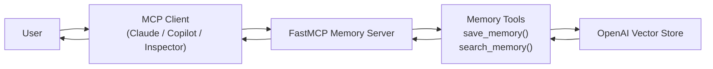
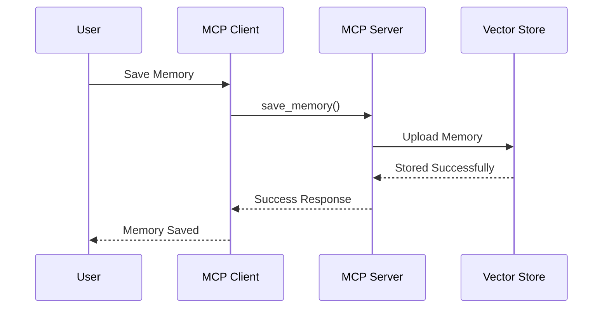
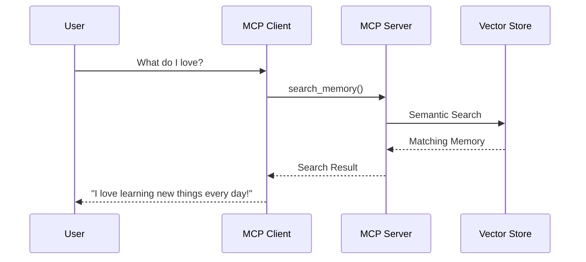
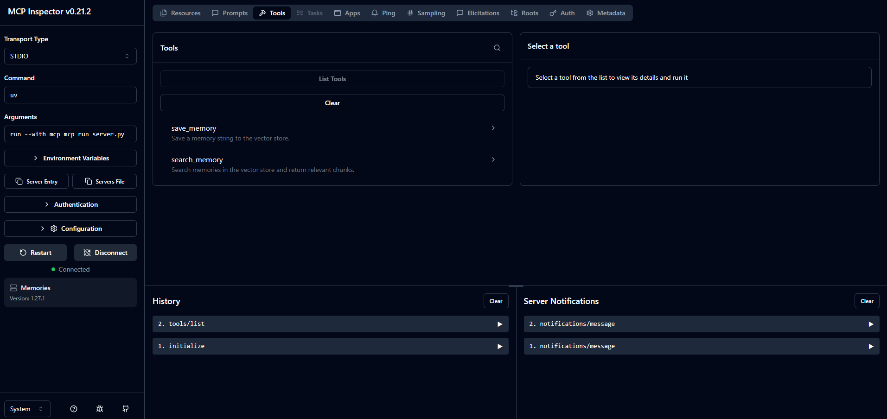
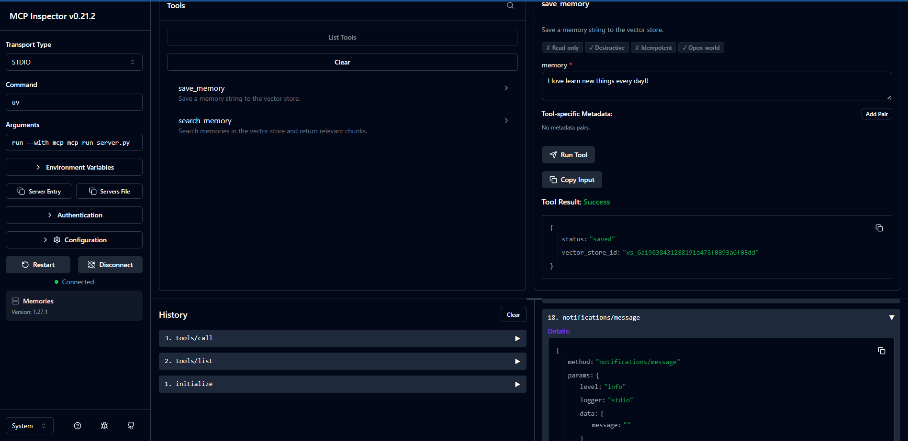
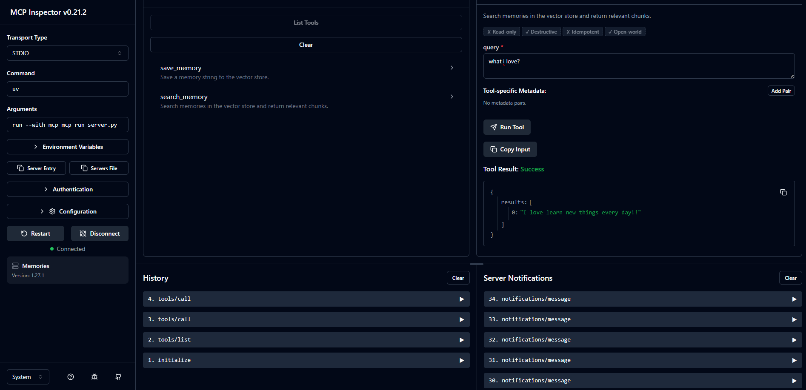
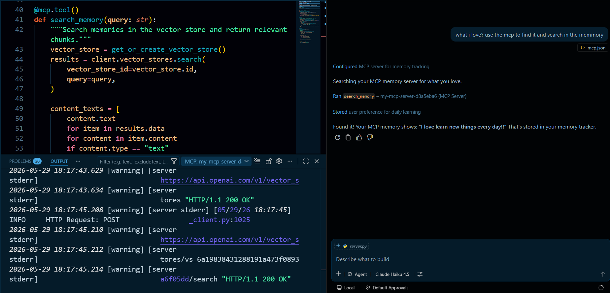
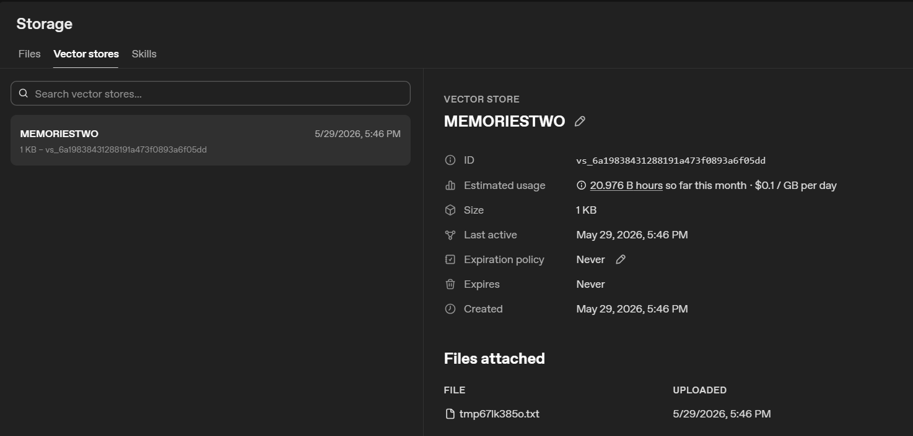

# 🧠 MCP Memory Server

<div align="center">


### Memory System for AI Agents using MCP and OpenAI Vector Stores

Store, retrieve, and manage memories through the Model Context Protocol (MCP), enabling AI agents to maintain persistent knowledge across conversations.

</div>

---

# 📖 Overview

Modern AI assistants are typically stateless, meaning they forget information between interactions.

This project solves that limitation by implementing a **Memory Server using the Model Context Protocol (MCP)** and **OpenAI Vector Stores**, allowing AI agents to:

* Remember user preferences
* Store important information
* Retrieve memories through semantic search
* Maintain context across sessions
* Act as a persistent memory layer for AI applications

The server exposes memory operations as MCP tools, making them accessible from MCP-compatible clients such as:

* Claude Desktop
* GitHub Copilot
* VS Code MCP
* MCP Inspector
* Custom MCP Clients

---

# ✨ Features

### Memory Storage

Persist user memories into OpenAI Vector Stores.

### Semantic Retrieval

Search memories using natural language rather than exact keyword matching.

### Automatic Vector Store Management

Automatically creates or reuses vector stores when the server starts.

### MCP Native

Fully compatible with the Model Context Protocol.

### Persistent Knowledge

Information remains available across multiple conversations and sessions.

### OpenAI-Powered Search

Leverages vector embeddings for intelligent memory retrieval.

---

# 🏗 System Architecture



---

# 🔄 Memory Storage Workflow



---

# 🔍 Memory Retrieval Workflow



---

# ⚙️ MCP Tools

The server exposes two MCP tools.

## save_memory

Stores a memory inside the vector store.

### Input

```json
{
  "memory": "I love learning new things every day!"
}
```

### Output

```json
{
  "status": "saved",
  "vector_store_id": "vs_xxxxx"
}
```

---

## search_memory

Retrieves relevant memories using semantic search.

### Input

```json
{
  "query": "What do I love?"
}
```

### Output

```json
{
  "results": [
    "I love learning new things every day!"
  ]
}
```

---

# 🚀 Installation

## Clone Repository

```bash
git clone https://github.com/udityamerit/Complete-Guide-to-MCP-in-Python.git

cd mcp-memory-server
```

## Create Virtual Environment

```bash
python -m venv .venv
```

### Windows

```bash
.venv\Scripts\activate
```

### Linux / macOS

```bash
source .venv/bin/activate
```

---

## Install Dependencies

```bash
pip install -r requirements.txt
```

or

```bash
pip install fastmcp openai python-dotenv
```

---

## Configure Environment Variables

Create a `.env` file:

```env
OPENAI_API_KEY=your_openai_api_key
```

---

# ▶ Running the MCP Server

```bash
python server.py
```

The server starts using:

```python
mcp.run(transport="stdio")
```

and becomes available to any MCP-compatible client. 

---

# 🧪 Testing with MCP Inspector

Configure MCP Inspector:

| Field     | Value                            |
| --------- | -------------------------------- |
| Transport | STDIO                            |
| Command   | uv                               |
| Arguments | run --with mcp mcp run server.py |

Once connected, MCP Inspector will automatically discover:

* save_memory
* search_memory

---

# 📸 Demonstration

## MCP Inspector Connection

```md
Images/inspector1.PNG
```



The MCP Inspector successfully discovers and connects to the Memory Server.

---

## Saving Memory

```md
Images/save_memory.PNG
```



Memory is uploaded and stored inside the vector database.

---

## Retrieving Memory

```md
Images/retrice_query.PNG
```



Semantic search retrieves the most relevant memory.

---

## GitHub Copilot Integration

```md
Images/memory_retrive_using_copilot.PNG
```



The memory server can be directly accessed from MCP-enabled GitHub Copilot environments.

---

## OpenAI Vector Store

```md
Images/stored_data.PNG
```



Stored memories can be viewed within the OpenAI Vector Store dashboard.

---

# 💡 Example Use Cases

### Personal AI Assistant

Remember user preferences across conversations.

### Learning Assistant

Store study notes and retrieve them later.

### Knowledge Management

Build a searchable personal knowledge base.

### Productivity Assistant

Track tasks, reminders, and project details.

### Research Assistant

Maintain research findings and references.

---

# 🔮 Future Enhancements

* Memory deletion
* Memory update functionality
* User-specific memory spaces
* Metadata filtering
* Hybrid search
* Memory summarization
* Multi-user support
* Memory categorization
* RAG integration

---

# 🛠 Tech Stack

| Technology           | Purpose                |
| -------------------- | ---------------------- |
| Python               | Backend Development    |
| FastMCP              | MCP Server Framework   |
| OpenAI SDK           | Vector Store Access    |
| OpenAI Vector Stores | Memory Storage         |
| MCP Inspector        | Testing                |
| GitHub Copilot       | MCP Client             |
| dotenv               | Environment Management |

---

# 📄 License

Distributed under the MIT License.

---

# 👨‍💻 Author

**Uditya Narayan Tiwari**

Portfolio: [https://udityanarayantiwari.netlify.app/](https://udityanarayantiwari.netlify.app/)

GitHub: [https://github.com/udityamerit](https://github.com/udityamerit)

LinkedIn: [https://www.linkedin.com/in/uditya-narayan-tiwari-562332289/](https://www.linkedin.com/in/uditya-narayan-tiwari-562332289/)

Knowledge Base: [https://udityaknowledgebase.netlify.app/](https://udityaknowledgebase.netlify.app/)

---

<div align="center">

### ⭐ If you found this project useful, consider giving it a star.

Built with FastMCP, OpenAI Vector Stores, and the Model Context Protocol.

</div>

