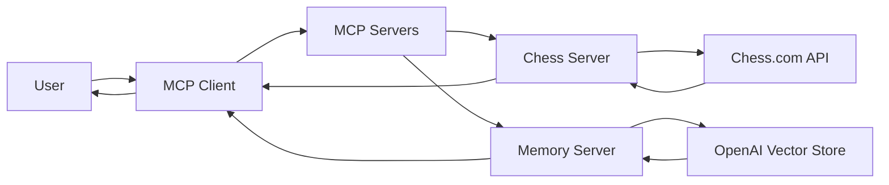

# 🚀 MCP Projects Collection

<div align="center">

### A Collection of Model Context Protocol (MCP) Servers Built Using Python, FastMCP, OpenAI, and External APIs

This repository contains multiple MCP server implementations demonstrating real-world integrations, AI tool calling, memory systems, and external API connectivity.

</div>

---

# 📖 Overview

This repository serves as a learning and development hub for building applications using the **Model Context Protocol (MCP)**.

Each project demonstrates a different use case of MCP, ranging from external API integrations to AI-powered memory systems.

The goal of these projects is to explore how AI assistants can interact with tools, APIs, databases, and knowledge systems through MCP.

---

# 📂 Projects Included

## ♟️ Chess.com MCP Server

A Model Context Protocol server that integrates with the Chess.com Public API.

### Features

* Retrieve player profiles
* Retrieve player statistics
* Compare players
* Access live Chess.com data
* AI tool calling support

### Technologies

* Python
* FastMCP
* Requests
* Chess.com API

### Example Use Cases

* Compare Magnus Carlsen and Hikaru Nakamura
* Analyze player ratings
* Fetch live chess statistics
* Build chess-focused AI assistants

---

## 🧠 MCP Memory Server

A persistent memory system for AI agents using OpenAI Vector Stores.

### Features

* Store memories
* Semantic memory retrieval
* Persistent knowledge storage
* Vector search
* AI memory management

### Technologies

* Python
* FastMCP
* OpenAI SDK
* OpenAI Vector Stores
* dotenv

### Example Use Cases

* Personal AI assistants
* Knowledge management
* Learning assistants
* Long-term memory systems
* Research assistants

---

# 🔄 High-Level Architecture



---

# 🎯 Learning Objectives

These projects demonstrate:

* MCP Fundamentals
* FastMCP Development
* Tool Registration
* API Integration
* AI Tool Calling
* Vector Databases
* OpenAI Integrations
* Memory Systems
* Client-Server Communication
* Production MCP Development

---

# 🛠 Technology Stack

| Technology           | Purpose               |
| -------------------- | --------------------- |
| Python               | Backend Development   |
| FastMCP              | MCP Server Framework  |
| OpenAI SDK           | AI Integrations       |
| OpenAI Vector Stores | Memory Storage        |
| Requests             | API Communication     |
| dotenv               | Environment Variables |
| MCP Inspector        | Testing               |
| GitHub Copilot       | MCP Client            |
| Chess.com API        | Chess Data            |

---

# 📸 Project Demonstrations

## Chess MCP Server

### Tool Discovery


### Player Statistics


### Player Comparison


---

## Memory MCP Server

### MCP Inspector Connection


### Saving Memory


### Retrieving Memory


### OpenAI Vector Store


---

# 🚀 Getting Started

Clone the repository:

```bash
git clone https://github.com/udityamerit/Complete-Guide-to-MCP-in-Python.git
```

Move into any project folder:

```bash
cd "Chess Stats"
```

or

```bash
cd "Memory Tracker"
```

Follow the individual project README files for detailed setup instructions.

---
# Author

## 👨‍💻 Uditya Narayan Tiwari

🌐 Portfolio: https://udityanarayantiwari.netlify.app/  
📚 Knowledge Base: https://udityaknowledgebase.netlify.app/  
💻 GitHub: https://github.com/udityamerit  
🔗 LinkedIn: https://www.linkedin.com/in/uditya-narayan-tiwari-562332289/  

---

## Star The Repository

If this project helped you understand MCP and OpenAI Tool Calling, consider giving it a ⭐ on GitHub.