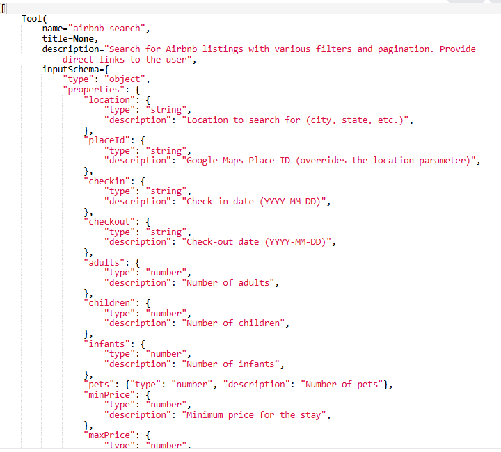
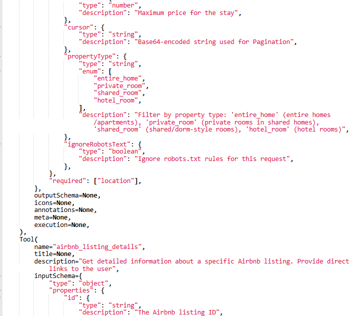
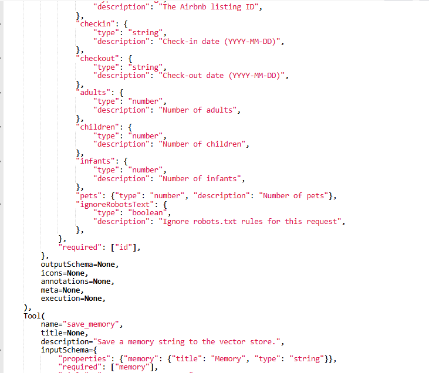
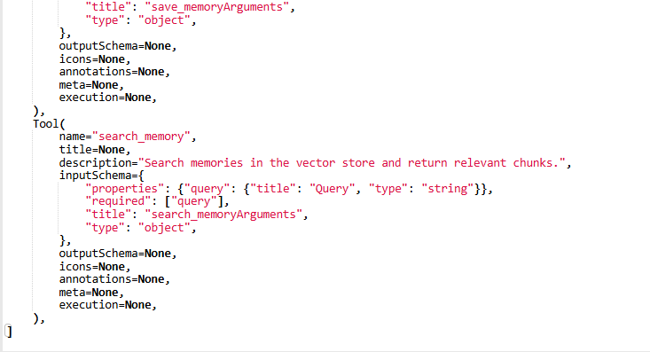
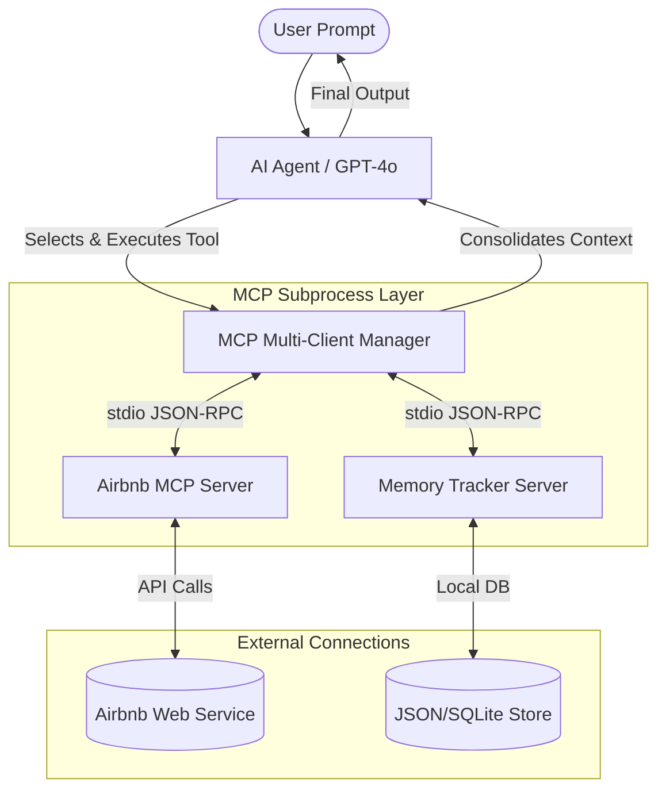
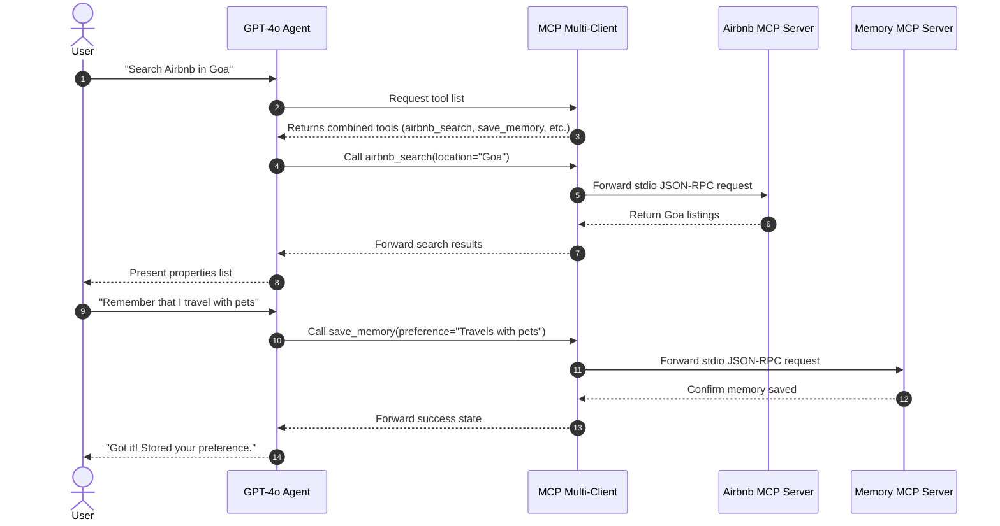

# Multi-Server MCP Agent: Airbnb Finder & Memory Tracker

[](https://python.org)
[](https://modelcontextprotocol.io)
[](https://openai.com)
[](https://streamlit.io)
[](https://opensource.org/licenses/MIT)

This project demonstrates a production-grade implementation of the **Model Context Protocol (MCP)** using Python. It aggregates multiple independent MCP servers—specifically an **Airbnb Search Server** and a local **Memory Tracker Server**—into a single agentic session powered by OpenAI's `gpt-4o`. 

Through this implementation, the AI agent dynamically discovers available tools, selects the appropriate server based on user intent, and persists user preferences (memories) to tailor future search results.

---

## 📸 Interactive Previews

Here is the dynamic tool registry discovery in action, showcasing how the agent identifies, maps, and exposes tools from multiple separate MCP servers:

<p align="center">
  
  <br><em>Figure 1: Initial tool handshake displaying active connection to both Airbnb and Memory servers.</em>
</p>

<p align="center">
  
  <br><em>Figure 2: Execution trace of a search tool query.</em>
</p>

<p align="center">
  
  <br><em>Figure 3: Agent automatically saving user preferences into the memory server database.</em>
</p>

<p align="center">
  
  <br><em>Figure 4: Recall query pulling past preferences from memory to filter listings.</em>
</p>

---

## 🚀 Key Features

### 1. Airbnb MCP Server Integration
Exposes lodging search and property detail extraction tools to the LLM:
* **Advanced Listing Search:** Query properties using criteria such as location, check-in/out dates, guest counts (adults, children, infants, pets), price ranges, and property types (*Entire Home, Private Room, Shared Room, Hotel Room*).
* **Deep Details Retrieval:** Extract specific property profiles containing amenities, host credentials, ratings, and active booking links.

### 2. Memory Tracker MCP Server Integration
Maintains persistent context across interactions without expanding the LLM's prompt window:
* **Preference Persistence:** Automatically saves details like traveler profiles (*"I travel with 4 adults"*), pet preferences (*"I always travel with my dog"*), or preferred destinations.
* **Context Recall:** Queries past preferences to refine Airbnb search constraints (e.g., adding `pets=1` automatically to search parameters if the user has a saved memory about traveling with pets).

---

## 🏗️ System Architecture

The project utilizes a modular, decentralized agent architecture:



---

## 🔄 Sequence Workflow

The diagram below highlights the flow when a user requests a search and saves a preference:



---

## 🧠 Exponentiated Capabilities (Available Tools)

The agent dynamically registers and exposes the following tools:

| Tool | Source | Input Schema Parameters | Purpose |
| :--- | :--- | :--- | :--- |
| `airbnb_search` | Airbnb Server | `location` (str), `checkin` (str), `checkout` (str), `adults` (int), `pets` (int), `price_min` (int), `price_max` (int), `property_type` (str) | Searches active Airbnb listings. |
| `airbnb_listing_details` | Airbnb Server | `listing_id` (str) | Fetches complete amenities, host details, and ratings for a listing. |
| `save_memory` | Memory Server | `memory` (str) | Persists user facts and preferences to the database. |
| `search_memory` | Memory Server | `query` (str) | Queries the memory store to retrieve past user facts. |

---

## 🛠️ Installation & Quickstart

### Prerequisites
* **Python:** v3.10 or higher
* **Node.js & npm:** Required to run the Node-based Airbnb MCP server.

### 1. Clone & Navigate
```bash
git clone https://github.com/udityamerit/Complete-Guide-to-MCP-in-Python.git
cd airbnb-mcp-chatbot
```

### 2. Set Up Virtual Environment
Using [uv](https://github.com/astral-sh/uv) (recommended):
```bash
# Create virtual environment
uv venv

# Activate on Windows
.venv\Scripts\activate

# Activate on macOS/Linux
source .venv/bin/activate
```
*Alternatively, use standard virtualenv:*
```bash
python -m venv .venv
source .venv/bin/activate  # Or .venv\Scripts\activate on Windows
```

### 3. Install Dependencies
```bash
# Using uv (fastest)
uv pip install -r requirements.txt

# Or using standard pip
pip install -r requirements.txt
```

### 4. Install Node-based Airbnb Server
The Airbnb MCP server is executed as a global node subprocess:
```bash
npm install -g @openbnb/mcp-server-airbnb
```

### 5. Environment Settings
Create a `.env` file in the root directory:
```env
OPENAI_API_KEY=your_openai_api_key_here
```

---

## ▶️ Running the Application

### Option A: Command Line Interface (CLI)
For a lightweight, terminal-based chat session:
```bash
python client.py
```
**Example Session:**
```text
Connected to MCP Servers. Type 'exit' to quit.

You: I want to look for a place in Seattle for 2 adults. Also, please remember that I love cabins.
AI: [Calling save_memory] -> Saved preference: "Loves cabins"
AI: [Calling airbnb_search] -> Searching properties in Seattle...
Here are some cabin properties in Seattle...
```

### Option B: Streamlit Web UI (Graphical Interface)
For a premium chat experience with persistent session states and tool call visibility:
```bash
streamlit run chat_ui.py
```
This launches a local web server (usually at `http://localhost:8501`) and opens the interface in your browser.

---

## 💻 Tech Stack & Dependencies

* **Core Language:** Python 3.10+
* **AI Orchestration:** OpenAI API (GPT-4o), Model Context Protocol Python SDK (`mcp`)
* **Subprocess Execution:** Node.js runtime, standard Python `asyncio`
* **Frontend UI:** Streamlit
* **Dependency Manager:** uv / pip

---

## 🔍 Code Deep Dive: Dynamic Tool Consolidation
When the client boots up, it initiates subprocesses for each server and aggregates their JSON-RPC tool specifications:

```python
# Create connection parameters
server_params_airbnb = StdioServerParameters(
    command="npx",
    args=["-y", "@openbnb/mcp-server-airbnb", "--ignore-robots-txt"]
)

# Connect and combine tools
async with stdio_client(server_params_airbnb) as (read1, write1):
    async with stdio_client(server_params_memory) as (read2, write2):
        # Tools from both servers are fetched and combined:
        tools_result_airbnb = await session_airbnb.list_tools()
        tools_result_memory = await session_memory.list_tools()
        
        combined_tools = tools_result_airbnb.tools + tools_result_memory.tools
        # The consolidated schema is sent directly to OpenAI's tool-calling API
```

---

## 📖 Key Learning Outcomes

By reviewing the codebase, you will understand:
1. **MCP Client Architectures:** How to build async python clients that lifecycle-manage local and remote MCP subprocesses.
2. **Session Multiplexing:** How to feed tools from multiple decoupled servers into a single LLM loop.
3. **Function Calling & Orchestration:** Implementing complex tool-use workflows where the model decides when to write memory and when to query external APIs.
4. **Interactive App Design:** Linking async background client processes with Streamlit's sync rendering cycles.

---

## 🤝 Contributing & Support

1. Fork this repository.
2. Create your branch (`git checkout -b feature/CoolNewFeature`).
3. Commit your changes (`git commit -m 'Add CoolNewFeature'`).
4. Push to the branch (`git push origin feature/CoolNewFeature`).
5. Open a Pull Request.

---

## 📜 License

This project is licensed under the MIT License - see the [LICENSE](LICENSE) file for details.
