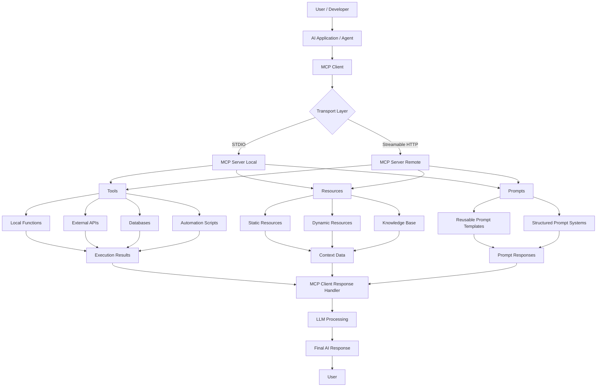
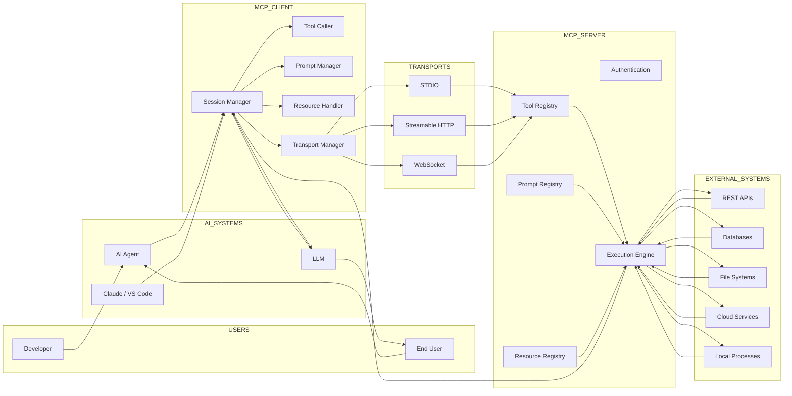
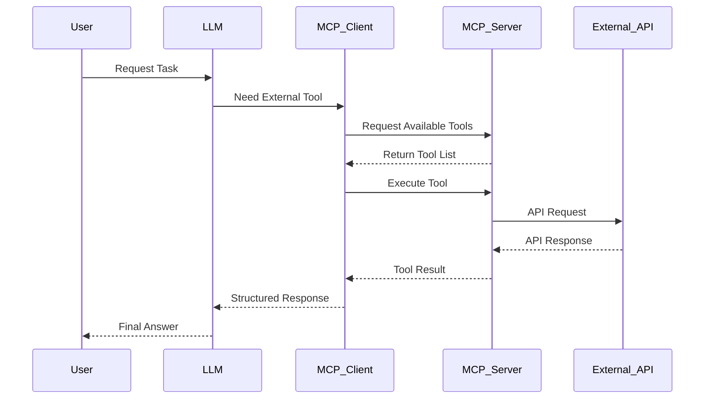
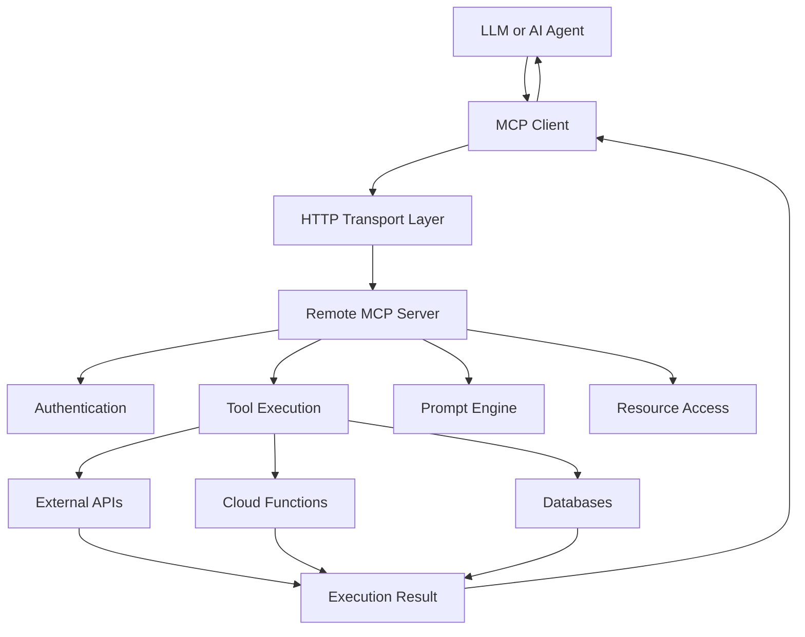
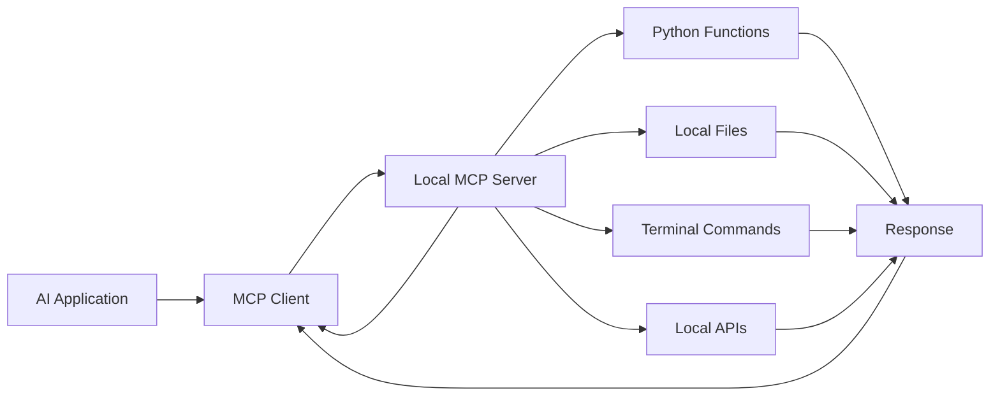
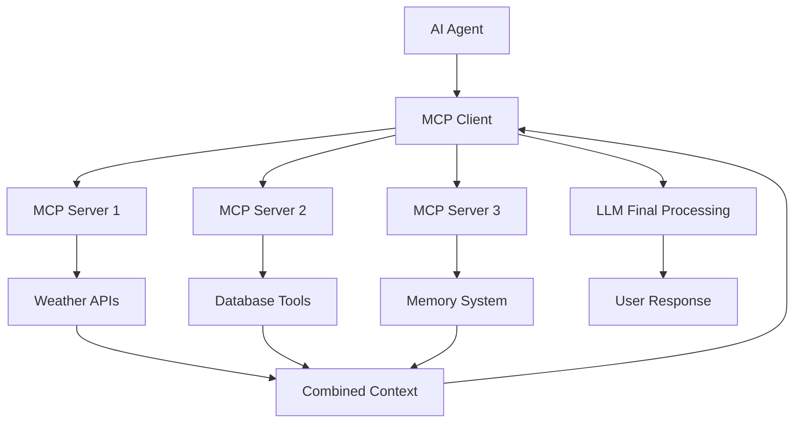
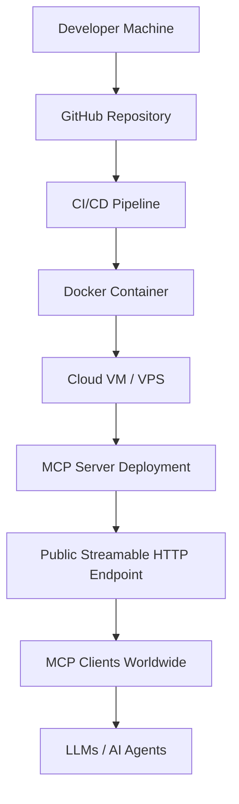

# 🚀 Complete Guide to MCP in Python

<div align="center">


<h3>The Ultimate Beginner-to-Advanced Guide for Building MCP Servers & Clients with Python</h3>

<p>
Learn the complete architecture, protocol, deployment, and real-world implementation of MCP (Model Context Protocol) using Python.
</p>

</div>

---

# 📌 Table of Contents

- [What is MCP?](#-what-is-mcp)
- [Why MCP Matters](#-why-mcp-matters)
- [About This Repository](#-about-this-repository)
- [Features](#-features)
- [Course Overview](#-course-overview)
- [Architecture Flow](#-architecture-flow)
- [Advanced MCP Architecture](#-advanced-mcp-architecture)
- [Client-Server Communication Flow](#-client-server-communication-flow)
- [STDIO vs Streamable HTTP](#-stdio-vs-streamable-http)
- [Multi-Server MCP Architecture](#-multi-server-mcp-architecture)
- [Deployment Architecture](#-deployment-architecture)
- [Tech Stack](#-tech-stack)
- [Installation](#-installation)
- [Project Structure](#-project-structure)
- [Learning Outcomes](#-learning-outcomes)
- [Prerequisites](#-prerequisites)
- [Who Is This For?](#-who-is-this-for)
- [Contributing](#-contributing)
- [Connect With Me](#-connect-with-me)
- [License](#-license)

---

# 📖 What is MCP?

**MCP (Model Context Protocol)** is a standardized protocol that allows AI systems like:

- LLMs
- AI Agents
- AI Applications
- Automation Systems

to communicate with:

- APIs
- Databases
- Local Tools
- External Services
- Resources
- Prompts
- File Systems

Think of MCP as the:

> 🔌 USB-C Connector for AI Systems

Build once → Connect everywhere.

---

# 🌍 Why MCP Matters

Before MCP:

❌ Every framework implemented tools differently  
❌ Developers repeatedly rebuilt integrations  
❌ No universal AI-tool communication standard  

MCP solves this using:

✅ Standardization  
✅ Reusability  
✅ Scalability  
✅ Universal Connectivity  
✅ Plug-and-Play AI Systems  

Today, MCP is widely adopted across the AI ecosystem.

---

# 🎯 About This Repository

This repository is a complete beginner-to-advanced guide focused on:

- MCP Architecture
- MCP Servers
- MCP Clients
- MCP Deployment
- MCP Publishing
- Streamable HTTP
- STDIO Communication
- Resources
- Prompts
- Tools
- Real-World Projects

This repository uses:

🐍 Python SDK exclusively

making it perfect for Python developers entering the AI infrastructure ecosystem.

---

# ✨ Features

## ✅ Complete Guide

This is NOT a crash course.

You go from:

```text
Beginner
   ↓
Understanding MCP
   ↓
Building MCP Servers
   ↓
Building MCP Clients
   ↓
Deploying MCP Applications
   ↓
MCP Expert
```

---

## 🐍 Python Focused

Unlike most tutorials using JS/TS, this repository focuses completely on Python.

---

## ⚡ Fully Updated

Includes modern MCP technologies:

- Streamable HTTP
- STDIO
- MCP Inspector
- Remote MCP Servers
- Multi-server orchestration

---

## 🛠️ Hands-On Learning

Build multiple:

- MCP Servers
- MCP Clients
- AI integrations
- Real-world projects

---

# 📚 Repository Overview

Explore the step-by-step curriculum of the complete MCP course:

### [01. Introduction](01%20Introduction)
- What Model Context Protocol (MCP) is and why it exists
- Interactive guide to the MCP ecosystem
- Hands-on Jupyter notebook for beginners

---

### [02. MCP Architecture Overview](02%20MCP%20Architecture%20Overview)
- Learn key terminology: Clients, Hosts, Servers, Transports, and Sessions
- Core building blocks: Tools, Resources, and Prompts
- Deep architectural diagrams and communication flows

---

### [03. Creating and Connecting MCP Server](03%20Creating%20and%20Connecting%20MCP%20Server)
- Setting up a Python development environment with the **UV** package manager
- Building your very first custom weather MCP server
- Connecting the server to **Claude Desktop** and using it locally

---

### [04. Connect MCP Client to an MCP Server](04%20Connect%20MCP%20Client%20to%20an%20MCP%20Server)
- Implementing an asynchronous Python MCP client
- Connecting the client to a local weather server using `stdio` transport
- Connecting to remote servers using NPX (e.g., openbnb/mcp-server-airbnb)

---

### [05. MCP Server Deep Dive - Tools](05%20MCP%20Server%20Deep%20Dive%20-%20Tools)
- Creating advanced MCP tools using FastMCP
- Cryptocurrency price tracking tools (CoinGecko API)
- Operating system utilities (Screenshot Capturing with PyAutoGUI)
- External AI search integrations (Perplexity AI API)
- Complex validation using Pydantic models for structured input

---

### [06. MCP Server Resources and Prompts](06%20MCP%20Server%20Resourese%20and%20Prompts)
- **Resources**: Exposing local data, inventory lists, and dynamically resolved prices using custom URIs (`inventory://`)
- **Prompts**: Developing structured, reusable prompt templates for LLMs to generate reports or analyses

---

### [07. MCP Server Deployment and Publishing](07%20MCP%20Server%20Deployment%20and%20Publishing)
- Standard packaging structure for Python MCP servers (`src/` architecture)
- Configuring `pyproject.toml` with console scripts entry points
- Publishing MCP servers to GitHub and running them globally via `uvx`

---

### [08. MCP Server stdio and Streamable HTTP](08%20MCP%20Server%20stdio%20and%20Streamable%20https)
- Creating servers using `streamable-http` transport (FastMCP SSE)
- Testing and debugging servers using **MCP Inspector** (`npx @modelcontextprotocol/inspector`)
- Public deployment on AWS EC2 Virtual Machines (Nginx reverse proxy, PM2/Screen process managers)

---

### [09. MCP Client Deep Dive](09%20MCP%20Client%20Deep%20Dive)
- Developing an advanced Python client integrated with **OpenAI API**
- Auto-discovery of MCP tools and schema translation to OpenAI Function Calling format
- Letting the model decide on tool invocations and feeding tool outputs back to GPT

---

### [10. End-To-End Projects](10%20End-To-End%20Project)
- Real-world, production-ready project implementations:
  1. **Chess Stats**: A custom MCP server connecting to the Chess.com public API for player stats and comparisons
  2. **Memory Tracker**: A persistent long-term semantic memory storage server for AI agents using OpenAI Vector Stores

---

### [11. Build MCP Client with Multi MCP Server](11%20Build%20MCP%20Client%20with%20Multi%20MCP%20Server)
- Orchestrating multiple independent MCP servers (Airbnb and Memory Tracker) in a single Python client
- Connecting client session dynamically to manage multi-server capabilities and auto-route tool calls
- Creating user-friendly graphical interfaces using Streamlit for complex multi-tool chats

---

# 🏗️ Architecture Flow

## MCP Architecture Flow



---

# 🌐 Advanced MCP Architecture



---

# 🔄 Client-Server Communication Flow



---

# ⚡ STDIO vs Streamable HTTP

## Streamable HTTP Architecture



---

## Local STDIO Architecture



---

# 🧠 Multi-Server MCP Architecture



---

# 🚀 Deployment Architecture



---

# 🛠️ Tech Stack

| Technology | Purpose |
|---|---|
| Python | Core Development |
| MCP SDK | MCP Development |
| VS Code | Development |
| Git & GitHub | Version Control |
| Claude | MCP Host |
| APIs | External Integrations |

---

# ⚙️ Installation

## Clone Repository

```bash
git clone https://github.com/udityamerit/Complete-Guide-to-MCP-in-Python.git
```

---

## Move into Directory

```bash
cd Complete-Guide-to-MCP-in-Python
```

---

## Create Virtual Environment

```bash
python -m venv venv
```

---

## Activate Environment

### Windows

```bash
venv\Scripts\activate
```

### Mac/Linux

```bash
source venv/bin/activate
```

---

## Install Dependencies

```bash
pip install -r requirements.txt
```

---

# ▶️ Running MCP Projects

This repository is organized into standalone chapter directories. Each folder contains its own self-contained code files, configuration, and dependencies.

To run a specific project:
1. Navigate to the desired folder:
   ```bash
   cd "05 MCP Server Deep Dive - Tools"
   ```
2. Follow the detailed setup and execution instructions inside the directory's `README.md`.
3. Most servers can be run directly using `uv run <filename>.py` or standard `python <filename>.py` after installing dependencies.

---

# 📂 Project Structure

```bash
📦 Complete-Guide-to-MCP-in-Python
 ┣ 📂 01 Introduction
 ┃ ┣ 📜 introduction.ipynb
 ┃ ┗ 🌐 introduction.html
 ┣ 📂 02 MCP Architecture Overview
 ┃ ┣ 📜 MCP Architecture.ipynb
 ┃ ┗ 🌐 MCP Architecture.html
 ┣ 📂 03 Creating and Connecting MCP Server
 ┃ ┣ 📜 weather.py
 ┃ ┗ 📜 README.md
 ┣ 📂 04 Connect MCP Client to an MCP Server
 ┃ ┣ 📜 client.py
 ┃ ┣ 📜 client_npx.py
 ┃ ┗ 📜 README.md
 ┣ 📂 05 MCP Server Deep Dive - Tools
 ┃ ┣ 📜 crypto.py
 ┃ ┣ 📜 local.py
 ┃ ┣ 📜 screenshot.py
 ┃ ┣ 📜 websearch_perpexity_model.py
 ┃ ┣ 📜 complex_input_mcp.py
 ┃ ┗ 📜 README.md
 ┣ 📂 06 MCP Server Resourese and Prompts
 ┃ ┣ 📜 prompt.py
 ┃ ┣ 📜 resources.py
 ┃ ┗ 📜 README.md
 ┣ 📂 07 MCP Server Deployment and Publishing
 ┃ ┣ 📂 src/mcpserver/
 ┃ ┣ 📜 pyproject.toml
 ┃ ┗ 📜 README.md
 ┣ 📂 08 MCP Server stdio and Streamable https
 ┃ ┣ 📂 Images/
 ┃ ┣ 📜 server.py
 ┃ ┣ 📜 main.py
 ┃ ┗ 📜 README.md
 ┣ 📂 09 MCP Client Deep Dive
 ┃ ┣ 📂 Images/
 ┃ ┣ 📜 client_query.py
 ┃ ┗ 📜 README.md
 ┣ 📂 10 End-To-End Project
 ┃ ┣ 📂 Chess Stats
 ┃ ┃ ┣ 📂 Images/
 ┃ ┃ ┣ 📂 src/chess_stats/
 ┃ ┃ ┗ 📜 README.md
 ┃ ┗ 📂 Memory Tracker
 ┃   ┣ 📂 Images/
 ┃   ┣ 📜 server.py
 ┃   ┗ 📜 README.md
 ┗ 📂 11 Build MCP Client with Multi MCP Server
   ┣ 📂 Images/
   ┣ 📜 client.py
   ┣ 📜 chat_ui.py
   ┣ 📜 main.py
   ┣ 📜 pyproject.toml
   ┗ 📜 README.md
```

---

# 📸 Project Demos & Screenshots

Here are some visual demonstrations of the projects in action, taken from the local debug consoles, Claude Desktop, and the MCP Inspector.

## ♟️ Chess.com Stats MCP Server (Chapter 10)

#### 🔍 Chess Tool Discovery
Discovering available Chess tools in the client:


#### 📈 Chess Player Stats
Fetching real-time player ratings and stats from Chess.com API:


#### ⚔️ Player Comparison
Comparing two chess masters' stats side-by-side using the AI:


---

## 🧠 OpenAI Vector Store Memory Tracker (Chapter 10)

#### 💾 Saving Dynamic Memory
AI agent saving a memory dynamically into the OpenAI Vector Store:


#### 🔍 Semantic Memory Retrieval
Retrieving semantic memories based on natural language queries:


#### 🖥️ Inspector Connection
The Memory Tracker MCP Server connected to the local MCP Inspector:


---

## 🛠️ MCP Client Deep Dive & OpenAI Tool Calling (Chapter 09)

#### 📡 MCP Tool Discovery
Discovering tools from the local Python MCP server session:


#### 🤖 OpenAI Tool Conversion & Execution
Converting MCP tools schema to OpenAI Function Calling format and handling execution:


---

## ⚡ MCP Inspector & Streamable HTTP (Chapter 08)

#### 🔌 Connecting to Streamable HTTP Server
Testing local or remote Streamable HTTP MCP servers using the official MCP Inspector interface:


#### 🧪 Greeting Tool Test Execution
Executing a greeting tool call and receiving structured output inside MCP Inspector:


---

## 🌐 Multi-Server MCP Agent: Airbnb & Memory (Chapter 11)

#### 🔌 Multi-Server Tool Discovery
Discovering and combining tools from both Airbnb and Memory servers dynamically:


#### 🧠 Context-Aware Searches with Local Memory
Filtering Airbnb properties using retrieved semantic memories during the search query:


---

# 🎯 Learning Outcomes

By the end of this repository, you will:

✅ Understand MCP deeply  
✅ Build MCP Servers  
✅ Build MCP Clients  
✅ Deploy MCP remotely  
✅ Use Streamable HTTP  
✅ Use STDIO communication  
✅ Integrate AI tools  
✅ Build production-ready AI systems  

---

# 🧪 Prerequisites

- Basic Python knowledge
- Basic API understanding
- Familiarity with Git/GitHub
- Windows or Mac

---

# 👨‍💻 Who Is This For?

Perfect for:

- AI Engineers
- Python Developers
- AI Enthusiasts
- LLM Builders
- Automation Engineers
- AI Infrastructure Developers
- Agentic AI Developers

---

# 🤝 Contributing

Contributions are welcome.

## Steps

1. Fork repository
2. Create feature branch
3. Commit changes
4. Push changes
5. Open Pull Request

---

# ⭐ Support

If this repository helped you:

⭐ Star the repository  
🍴 Fork the repository  
📢 Share with others  

---

# 📬 Connect With Me

## 👨‍💻 Uditya Narayan Tiwari

🌐 Portfolio: https://udityanarayantiwari.netlify.app/  
📚 Knowledge Base: https://udityaknowledgebase.netlify.app/  
💻 GitHub: https://github.com/udityamerit  
🔗 LinkedIn: https://www.linkedin.com/in/uditya-narayan-tiwari-562332289/  

---

# 📜 License

This project is licensed under the MIT License.

---

<div align="center">

# 🚀 Build Once. Connect Everywhere.

### Power the Future of AI with MCP.

</div>
