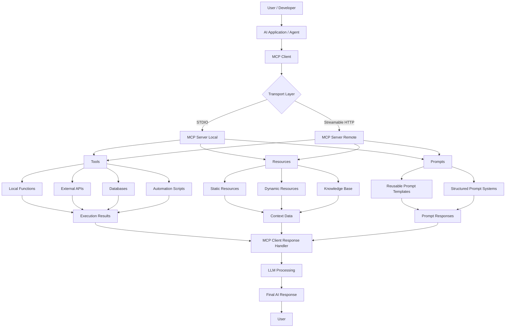
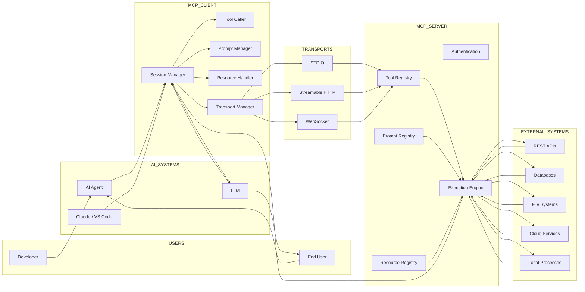
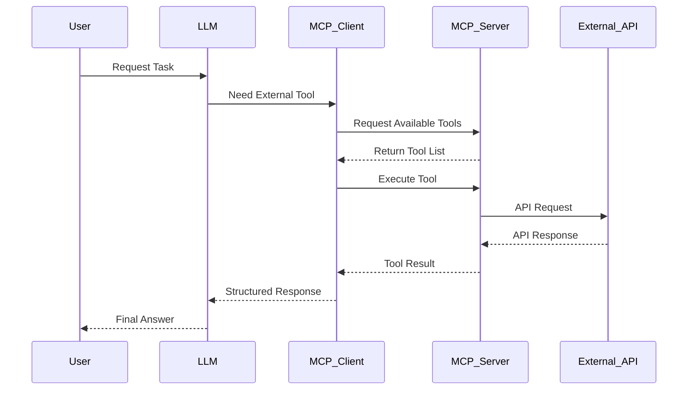
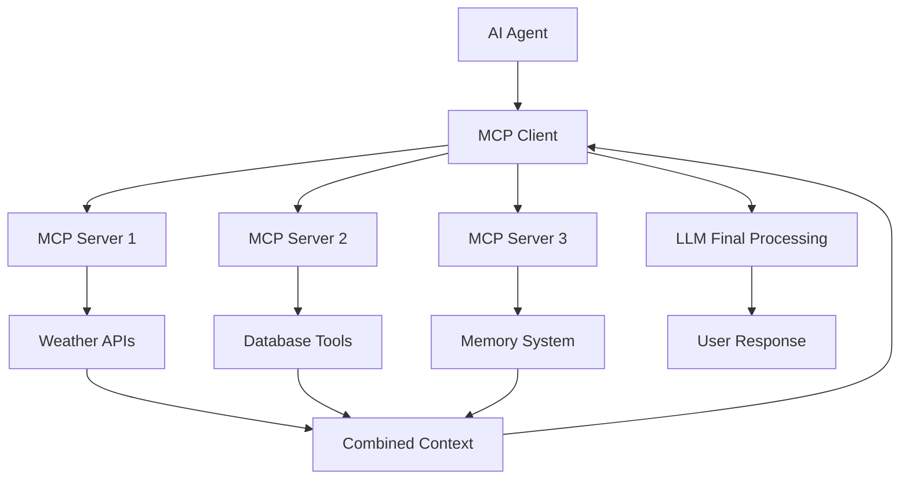
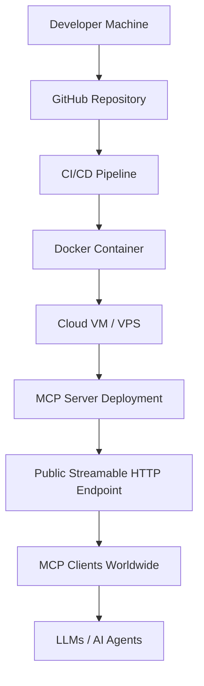

# 🚀 Complete Guide to MCP in Python

<div align="center">


<h3>The Ultimate Beginner-to-Advanced Guide for Building MCP Servers & Clients with Python</h3>

<p>
Learn the complete architecture, protocol, deployment, and real-world implementation of MCP (Model Context Protocol) using Python.
</p>

</div>

---

# 📌 Table of Contents

- [What is MCP?](#-what-is-mcp)
- [Why MCP Matters](#-why-mcp-matters)
- [About This Repository](#-about-this-repository)
- [Features](#-features)
- [Course Overview](#-course-overview)
- [Architecture Flow](#-architecture-flow)
- [Advanced MCP Architecture](#-advanced-mcp-architecture)
- [Client-Server Communication Flow](#-client-server-communication-flow)
- [STDIO vs Streamable HTTP](#-stdio-vs-streamable-http)
- [Multi-Server MCP Architecture](#-multi-server-mcp-architecture)
- [Deployment Architecture](#-deployment-architecture)
- [Tech Stack](#-tech-stack)
- [Installation](#-installation)
- [Project Structure](#-project-structure)
- [Learning Outcomes](#-learning-outcomes)
- [Prerequisites](#-prerequisites)
- [Who Is This For?](#-who-is-this-for)
- [Contributing](#-contributing)
- [Connect With Me](#-connect-with-me)
- [License](#-license)

---

# 📖 What is MCP?

**MCP (Model Context Protocol)** is a standardized protocol that allows AI systems like:

- LLMs
- AI Agents
- AI Applications
- Automation Systems

to communicate with:

- APIs
- Databases
- Local Tools
- External Services
- Resources
- Prompts
- File Systems

Think of MCP as the:

> 🔌 USB-C Connector for AI Systems

Build once → Connect everywhere.

---

# 🌍 Why MCP Matters

Before MCP:

❌ Every framework implemented tools differently  
❌ Developers repeatedly rebuilt integrations  
❌ No universal AI-tool communication standard  

MCP solves this using:

✅ Standardization  
✅ Reusability  
✅ Scalability  
✅ Universal Connectivity  
✅ Plug-and-Play AI Systems  

Today, MCP is widely adopted across the AI ecosystem.

---

# 🎯 About This Repository

This repository is a complete beginner-to-advanced guide focused on:

- MCP Architecture
- MCP Servers
- MCP Clients
- MCP Deployment
- MCP Publishing
- Streamable HTTP
- STDIO Communication
- Resources
- Prompts
- Tools
- Real-World Projects

This repository uses:

🐍 Python SDK exclusively

making it perfect for Python developers entering the AI infrastructure ecosystem.

---

# ✨ Features

## ✅ Complete Guide

This is NOT a crash course.

You go from:

```text
Beginner
   ↓
Understanding MCP
   ↓
Building MCP Servers
   ↓
Building MCP Clients
   ↓
Deploying MCP Applications
   ↓
MCP Expert
```

---

## 🐍 Python Focused

Unlike most tutorials using JS/TS, this repository focuses completely on Python.

---

## ⚡ Fully Updated

Includes modern MCP technologies:

- Streamable HTTP
- STDIO
- MCP Inspector
- Remote MCP Servers
- Multi-server orchestration

---

## 🛠️ Hands-On Learning

Build multiple:

- MCP Servers
- MCP Clients
- AI integrations
- Real-world projects

---

# 📚 Course Overview

## MCP Introduction

- What MCP is
- Why MCP exists
- History of MCP
- MCP ecosystem

---

## MCP Architecture

Learn:

- MCP Client
- MCP Server
- Sessions
- Tool Execution
- Resources
- Prompts
- Transport Protocols

---

## MCP Environment Setup

Setup:

- Python
- Git
- VS Code
- Claude
- MCP SDK

---

## MCP Quickstart

Build your first:

- MCP Server
- MCP Client

using real-world examples.

---

## MCP Deep Dive

### Tools
- API Integrations
- Local Functions
- Structured Inputs

### Resources
- Dynamic Resources
- Static Resources
- Knowledge Context

### Prompts
- Reusable Prompt Systems
- Prompt Templates

---

## Deployment & Publishing

Learn:

- Remote Hosting
- Streamable HTTP Servers
- GitHub Distribution
- Virtual Machine Deployment

---

# 🏗️ Architecture Flow

## MCP Architecture Flow



---

# 🌐 Advanced MCP Architecture



---

# 🔄 Client-Server Communication Flow



---

# ⚡ STDIO vs Streamable HTTP

## Streamable HTTP Architecture

```mermaid
flowchart TB

    A[LLM / AI Agent]
        |
        v

    B[MCP Client]
        |
        v

    C[HTTP Transport Layer]
        |
        v

    D[Remote MCP Server]
    
    D --> E[Authentication]
    D --> F[Tool Execution]
    D --> G[Prompt Engine]
    D --> H[Resource Access]

    F --> I[External APIs]
    F --> J[Cloud Functions]
    F --> K[Databases]

    I --> L[Execution Result]
    J --> L
    K --> L

    L --> B
    B --> A
```

---

## Local STDIO Architecture

```mermaid
flowchart LR

    A[AI Application]
        |
        v

    B[MCP Client]

    B <-- STDIO --> C[Local MCP Server]

    C --> D[Python Functions]
    C --> E[Local Files]
    C --> F[Terminal Commands]
    C --> G[Local APIs]

    D --> H[Response]
    E --> H
    F --> H
    G --> H

    H --> B
```

---

# 🧠 Multi-Server MCP Architecture



---

# 🚀 Deployment Architecture



---

# 🛠️ Tech Stack

| Technology | Purpose |
|---|---|
| Python | Core Development |
| MCP SDK | MCP Development |
| VS Code | Development |
| Git & GitHub | Version Control |
| Claude | MCP Host |
| APIs | External Integrations |

---

# ⚙️ Installation

## Clone Repository

```bash
git clone https://github.com/udityamerit/Complete-Guide-to-MCP-in-Python.git
```

---

## Move into Directory

```bash
cd Complete-Guide-to-MCP-in-Python
```

---

## Create Virtual Environment

```bash
python -m venv venv
```

---

## Activate Environment

### Windows

```bash
venv\Scripts\activate
```

### Mac/Linux

```bash
source venv/bin/activate
```

---

## Install Dependencies

```bash
pip install -r requirements.txt
```

---

# ▶️ Running MCP Projects

## Run MCP Server

```bash
python server.py
```

---

## Run MCP Client

```bash
python client.py
```

---

# 📂 Project Structure

```bash
📦 Complete-Guide-to-MCP-in-Python
 ┣ 📂 Introduction
 ┣ 📂 MCP Architecture
 ┣ 📂 Environment Setup
 ┣ 📂 MCP Quickstart
 ┣ 📂 MCP Servers
 ┃ ┣ 📂 Tools
 ┃ ┣ 📂 Resources
 ┃ ┣ 📂 Prompts
 ┃ ┣ 📂 Deployment
 ┃ ┗ 📂 Streamable HTTP
 ┣ 📂 MCP Clients
 ┣ 📂 End-to-End Projects
 ┗ 📂 Resources & Notes
```

---

# 🎯 Learning Outcomes

By the end of this repository, you will:

✅ Understand MCP deeply  
✅ Build MCP Servers  
✅ Build MCP Clients  
✅ Deploy MCP remotely  
✅ Use Streamable HTTP  
✅ Use STDIO communication  
✅ Integrate AI tools  
✅ Build production-ready AI systems  

---

# 🧪 Prerequisites

- Basic Python knowledge
- Basic API understanding
- Familiarity with Git/GitHub
- Windows or Mac

---

# 👨‍💻 Who Is This For?

Perfect for:

- AI Engineers
- Python Developers
- AI Enthusiasts
- LLM Builders
- Automation Engineers
- AI Infrastructure Developers
- Agentic AI Developers

---

# 🤝 Contributing

Contributions are welcome.

## Steps

1. Fork repository
2. Create feature branch
3. Commit changes
4. Push changes
5. Open Pull Request

---

# ⭐ Support

If this repository helped you:

⭐ Star the repository  
🍴 Fork the repository  
📢 Share with others  

---

# 📬 Connect With Me

## 👨‍💻 Uditya Narayan Tiwari

🌐 Portfolio: https://udityanarayantiwari.netlify.app/  
📚 Knowledge Base: https://udityaknowledgebase.netlify.app/  
💻 GitHub: https://github.com/udityamerit  
🔗 LinkedIn: https://www.linkedin.com/in/uditya-narayan-tiwari-562332289/  

---

# 📜 License

This project is licensed under the MIT License.

---

<div align="center">

# 🚀 Build Once. Connect Everywhere.

### Power the Future of AI with MCP.

</div>
=======
 
>>>>>>> e60bc22 (adding the introduciton)
